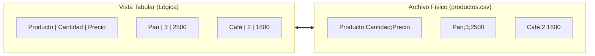
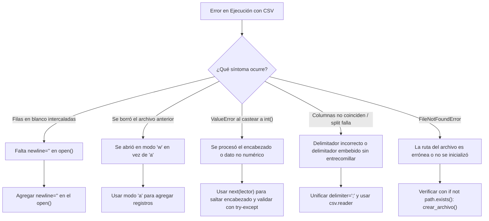

# 📊 Archivos CSV en Python: Guía Maestra de Persistencia y Estructuración

> [!NOTE]
> **Definición Fundamental y Propósito Pedagógico**  
> Un archivo **CSV** (*Comma-Separated Values* o Valores Separados por Delimitadores) es un archivo de texto plano estructurado donde cada línea física representa un **registro** y los caracteres delimitadores (como coma `,` o punto y coma `;`) demarcan los límites entre **campos o columnas**. Permite desacoplar el almacenamiento de datos en disco de la memoria volátil del programa, posibilitando el intercambio estándar con planillas de cálculo (Microsoft Excel, LibreOffice Calc) y bases de datos relacionales.

---

## 🏷️ Leyenda de Trazabilidad de Fuentes (Source Provenance Standard)

Para garantizar la máxima claridad académica y distinguir el origen del conocimiento:
* 🎓 `[Cátedra USS / Diapositivas Docente]`: Contenidos extraídos directamente de la presentación oficial `Presentacion_Archivos_CSV_Python.pdf` (enfoque manual con f-strings/split, módulo `csv`, `csv.writer`, `csv.reader`, `next()`, control de encabezados únicos, validación `try-except`, búsqueda `.lower()`, cálculos acumulativos de promedio, menú interactivo y actividad de aplicación `materiales.csv`).
* 📖 `[Texto Guía / Documentación Oficial Python / RFC 4180]`: Profundizaciones técnicas sobre el estándar IETF RFC 4180, el parámetro `newline=""` en la función `open()`, abstracción de diccionarios con `csv.DictReader`/`csv.DictWriter` y configuración de dialectos.
* 🌐 `[Enriquecimiento Web / Seguridad & Ecosistema]`: Prevención de vulnerabilidades de inyección de fórmulas (*CSV Formula Injection*), comparativa de escalabilidad frente a bibliotecas analíticas (Pandas/Polars) y optimización de entrada/salida.

---

## 📑 Tabla de Contenidos

1. [Anatomía y Fundamentos del Formato CSV](#1-anatomía-y-fundamentos-del-formato-csv-🎓-📖)
2. [Enfoque 1: Manipulación Manual con Cadenas y Split](#2-enfoque-1-manipulación-manual-con-cadenas-y-split-🎓)
3. [Enfoque 2: El Módulo Estándar csv y csv.writer](#3-enfoque-2-el-módulo-estándar-csv-y-csvwriter-🎓-📖)
4. [Lectura Estructurada con csv.reader y Manejo de Encabezados](#4-lectura-estructurada-con-csvreader-y-manejo-de-encabezados-🎓-📖)
5. [Abstracción Avanzada: csv.DictReader y csv.DictWriter](#5-abstracción-avanzada-csvdictreader-y-csvdictwriter-📖-🌐)
6. [El Estándar IETF RFC 4180 y Reglas de Escapado](#6-el-estándar-ietf-rfc-4180-y-reglas-de-escapado-📖-🌐)
7. [Manejo Defensivo: Creación de Encabezados Únicos y Validación](#7-manejo-defensivo-creación-de-encabezados-únicos-y-validación-🎓-📖)
8. [Seguridad en Producción: Prevención de CSV Injection](#8-seguridad-en-producción-prevención-de-csv-injection-🌐)
9. [Catálogo de Errores Frecuentes y Diagnóstico Rápido](#9-catálogo-de-errores-frecuentes-y-diagnóstico-rápido-🎓-📖)
10. [Tabla Comparativa de Paradigmas](#10-tabla-comparativa-de-paradigmas-🎓-📖-🌐)
11. [Caso Práctico Integral Modular: Sistema de Clientes USS](#11-caso-práctico-integral-modular-sistema-de-clientes-uss-🎓-📖)
12. [Actividad de Aplicación: materiales.csv](#12-actividad-de-aplicación-materialescsv-🎓)
13. [Batería de Preguntas de Autoevaluación Resueltas](#13-batería-de-preguntas-de-autoevaluación-resueltas-🎓-📖)

---

## 1. Anatomía y Fundamentos del Formato CSV 🎓 📖

### 1.1 Representación Isomórfica: Tabla vs. Texto Plano
Un archivo CSV no es un formato binario ni propietario; es simplemente texto plano legible por humanos que posee una correspondencia biunívoca con una tabla de dos dimensiones:



### 1.2 El Rol del Delimitador
El delimitador es un carácter especial acordado que demarca dónde finaliza un valor y dónde comienza el siguiente dentro de una misma fila.
* En el estándar internacional **RFC 4180** se utiliza la **coma** (`,`).
* En entornos hispanohablantes y configuraciones regionales de Windows/Excel (donde la coma se reserva como separador decimal matemático `3,14`), se utiliza comúnmente el **punto y coma** (`;`).

> [!IMPORTANT]
> **Principio de Claridad Conceptual 🎓**  
> El punto y coma (`;`) **no es una columna**: es únicamente la frontera sintáctica de separación entre campos.

---

## 2. Enfoque 1: Manipulación Manual con Cadenas y Split 🎓

El enfoque manual permite comprender la mecánica de bajo nivel de cómo viajan los bytes entre la memoria RAM y el disco físico antes de utilizar bibliotecas de abstracción.

### 2.1 Flujo de Escritura Manual (f-strings + Modo `'a'`)
1. **Definir el orden y contrato de campos:** `Producto ; Cantidad ; Precio`.
2. **Construir la cadena con salto de línea explícito (`\n`):**
   ```python
   producto = "Pan amasado"
   cantidad = 3
   precio = 2500
   linea = f"{producto};{cantidad};{precio}\n"
   ```
3. **Abrir en modo Append (`'a'`) con codificación UTF-8:**
   ```python
   with open("productos.csv", "a", encoding="utf-8") as archivo:
       archivo.write(linea)
   ```

### 2.2 Flujo de Lectura Manual (`for linea in archivo`, `strip()` y `split(';')`)
1. **Apertura en modo lectura (`'r'`):**
2. **Eliminación del salto de línea residual con `.strip()`:** Previene saltos dobles y errores de comparación.
3. **Descomposición con `.split(';')`:** Retorna una lista de cadenas `['Pan amasado', '3', '2500']`.
4. **Casting numérico explícito:** Los valores leídos desde disco son siempre de tipo `str`. Para efectuar operaciones aritméticas deben transformarse mediante `int()` o `float()`.

```python
# Ejemplo Completo de Manipulación Manual (Cátedra USS)
with open("productos.csv", "r", encoding="utf-8") as archivo:
    for linea in archivo:
        linea_limpia = linea.strip()
        if not linea_limpia:
            continue
        datos = linea_limpia.split(";")
        producto = datos[0]
        cantidad = int(datos[1])
        precio = int(datos[2])
        total = cantidad * precio
        print(f"Producto: {producto:<15} | Cantidad: {cantidad:>2} | Total: ${total:>6,}")
```

### 2.3 Limitaciones Críticas del Enfoque Manual 📖 🌐
¿Por qué no es recomendable el enfoque manual en aplicaciones de producción?
* **Fragilidad ante delimitadores embebidos:** Si un producto se llama `"Pack; Desayuno"`, la función `split(";")` dividirá la cadena en 4 fragmentos en lugar de 3, rompiendo la estructura de columnas y causando un fallo en el casting `int("Desayuno")` (`ValueError`).
* **Incompatibilidad con comillas dobles y saltos de línea multilínea.**

---

## 3. Enfoque 2: El Módulo Estándar `csv` y `csv.writer` 🎓 📖

Python incluye de forma nativa en su biblioteca estándar el módulo `csv` (no requiere instalación mediante `pip`), el cual implementa las reglas de análisis y serialización de archivos delimitados.

```python
import csv
```

### 3.1 La Importancia Crucial de `newline=""` en `open()` 📖
Al abrir un archivo para ser utilizado por el módulo `csv`, es **obligatorio** especificar `newline=""` en la función `open()`:

```python
with open("productos.csv", "w", newline="", encoding="utf-8") as archivo:
    escritor = csv.writer(archivo, delimiter=";", lineterminator="\n")
    escritor.writerow(["Producto", "Cantidad", "Precio"])
    escritor.writerow(["Pan", 3, 2500])
```

> [!WARNING]
> **¿Por qué es indispensable `newline=""`? 📖**  
> En los sistemas operativos Windows, el fin de línea estándar es `\r\n` (CRLF). Si no se indica `newline=""`, la capa de entrada/salida de texto de Python traduce automáticamente cada `\n` emitido por el módulo `csv` a `\r\r\n`, generando **filas en blanco vacías intercaladas** entre cada registro del archivo CSV. Con `newline=""`, Python delega el control total de los terminadores de línea al módulo `csv`.

### 3.2 Métodos Principales de `csv.writer`
* `escritor.writerow(secuencia)`: Serializa una lista o tupla en una única fila física del archivo.
* `escritor.writerows(lista_de_secuencias)`: Escribe de forma masiva una colección de filas iterables.

```python
# Escritura en lote con writerows
catalogo = [
    ["Pan Amasado", 3, 2500],
    ["Café de Grano", 2, 1800],
    ["Jugo Natural", 1, 2200]
]

with open("productos.csv", "w", newline="", encoding="utf-8") as archivo:
    escritor = csv.writer(archivo, delimiter=";", lineterminator="\n")
    escritor.writerow(["Producto", "Cantidad", "Precio"])  # Encabezado
    escritor.writerows(catalogo)  # Filas de datos
```

---

## 4. Lectura Estructurada con `csv.reader` y Manejo de Encabezados 🎓 📖

El objeto `csv.reader` es un iterador eficiente que lee el archivo en streaming ($\mathcal{O}(1)$ en memoria RAM), devolviendo automáticamente cada registro deserializado como una lista de cadenas (`list[str]`).

### 4.1 Extracción de Encabezados con `next()`
Cuando el archivo CSV posee una primera fila descriptiva con los nombres de las columnas, esta debe separarse del procesamiento de datos para evitar que intente ser convertida a números enteros:

```python
import csv

with open("productos.csv", "r", newline="", encoding="utf-8") as archivo:
    lector = csv.reader(archivo, delimiter=";")
    
    # 1. Separar el encabezado
    encabezado = next(lector)
    print(f"Columnas detectadas: {encabezado}")
    
    # 2. Iterar únicamente sobre las filas de datos
    for fila in lector:
        if not fila:  # Ignorar líneas vacías accidentales
            continue
        producto = fila[0]
        cantidad = int(fila[1])
        precio = int(fila[2])
        total = cantidad * precio
        print(f"Item: {producto:<15} -> Total: ${total:>6,}")
```

```
Columnas detectadas: ['Producto', 'Cantidad', 'Precio']
Item: Pan Amasado     -> Total: $ 7,500
Item: Café de Grano   -> Total: $ 3,600
Item: Jugo Natural    -> Total: $ 2,200
```

---

## 5. Abstracción Avanzada: `csv.DictReader` y `csv.DictWriter` 📖 🌐

Aunque la cátedra comienza con listas posicionales (`fila[0]`, `fila[1]`), en el desarrollo de software profesional se recomienda el uso de **diccionarios**, pues eliminan el acoplamiento a índices numéricos fijos.

### 5.1 `csv.DictReader`: Mapeo Directo a Diccionarios
`DictReader` utiliza automáticamente la primera fila como conjunto de claves (*keys*) y retorna cada registro subsecuente como un diccionario ordenado (`dict`):

```python
import csv

with open("productos.csv", "r", newline="", encoding="utf-8") as archivo:
    lector_dict = csv.DictReader(archivo, delimiter=";")
    for fila in lector_dict:
        # Acceso semántico por nombre de columna
        producto = fila["Producto"]
        cantidad = int(fila["Cantidad"])
        precio = int(fila["Precio"])
        print(f"Diccionario: {producto} | {cantidad} x ${precio}")
```

### 5.2 `csv.DictWriter`: Escritura Nominal
Permite guardar listas de diccionarios especificando los campos autorizados en `fieldnames`:

```python
import csv

nombres_columnas = ["Producto", "Cantidad", "Precio"]
datos_nuevos = [
    {"Producto": "Té Verde", "Cantidad": 5, "Precio": 1500},
    {"Producto": "Galletas", "Cantidad": 4, "Precio": 1200}
]

with open("productos.csv", "a", newline="", encoding="utf-8") as archivo:
    escritor_dict = csv.DictWriter(archivo, fieldnames=nombres_columnas, delimiter=";", lineterminator="\n")
    # No escribimos encabezado aquí porque el archivo ya existe (modo 'a')
    escritor_dict.writerows(datos_nuevos)
```

---

## 6. El Estándar IETF RFC 4180 y Reglas de Escapado 📖 🌐

La especificación técnica internacional **RFC 4180** establece el estándar universal para la interoperabilidad de archivos CSV:

| Regla RFC 4180 | Descripción Técnica | Ejemplo Válido |
| :--- | :--- | :--- |
| **Delimitador de Campos** | Separa los valores de una fila. Por defecto coma `,` (o `;` en dialectos regionales). | `Pan;3;2500` |
| **Terminador de Registro** | Cada registro debe finalizar con CRLF (`\r\n`) o LF (`\n`). | `Fila 1\nFila 2\n` |
| **Entrecomillado Obligatorio** | Si un campo contiene el delimitador, saltos de línea o comillas, **debe encerrarse entre comillas dobles (`"`)**. | `"Pack; Familiar";2;5000` |
| **Escapado de Comillas** | Si un campo entrecomillado contiene comillas dobles literales, **cada comilla se duplica (`""`)**. | `"Tornillo de 1/2"" acero";100;50` |

```python
# Demostración del comportamiento automático del módulo csv ante datos complejos
import csv
import io

buffer = io.StringIO()
escritor = csv.writer(buffer, delimiter=";")
escritor.writerow(['Tornillo de 1/2" acero', 'Pack; Especial', 1500])

print(buffer.getvalue())
# Salida automática: "Tornillo de 1/2"" acero";"Pack; Especial";1500
```

---

## 7. Manejo Defensivo: Creación de Encabezados Únicos y Validación 🎓 📖

Uno de los requerimientos más importantes de la cátedra es asegurar que los **encabezados se escriban una sola vez** cuando el archivo es creado, y que no se dupliquen cada vez que un usuario ingresa un nuevo registro.

### 7.1 Patrón de Verificación de Existencia (`os.path.exists` o `Path.exists`)

```python
import csv
from pathlib import Path

ARCHIVO_CLIENTES = Path("clientes.csv")

def inicializar_archivo_clientes() -> None:
    """Crea el archivo CSV con sus encabezados solo si no existe en disco."""
    if not ARCHIVO_CLIENTES.exists():
        with ARCHIVO_CLIENTES.open("w", newline="", encoding="utf-8") as f:
            escritor = csv.writer(f, delimiter=";", lineterminator="\n")
            escritor.writerow(["Nombre", "Edad", "Ciudad"])
        print(f"Archivo '{ARCHIVO_CLIENTES}' creado exitosamente con sus encabezados.")
    else:
        print(f"Archivo '{ARCHIVO_CLIENTES}' ya existe. Listo para registrar datos.")
```

### 7.2 Validación Robusta de Entradas antes de la Persistencia 🎓
Para evitar contaminar el archivo persistente con registros corruptos o incompletos, se debe validar rigurosamente en memoria:

```python
def validar_datos_cliente(nombre: str, edad_str: str, ciudad: str) -> tuple[bool, str, int]:
    """Valida los campos obligatorios y la coherencia numérica de la edad."""
    nombre_limpio = nombre.strip()
    ciudad_limpia = ciudad.strip()
    
    if not nombre_limpio:
        return False, "El nombre del cliente no puede estar vacío.", 0
    if not ciudad_limpia:
        return False, "La ciudad no puede estar vacía.", 0
        
    try:
        edad = int(edad_str.strip())
        if edad <= 0 or edad > 125:
            return False, "La edad debe ser un entero positivo válido (1-125).", 0
    except ValueError:
        return False, "La edad ingresada debe ser un valor numérico entero.", 0
        
    return True, "Datos válidos.", edad
```

---

## 8. Seguridad en Producción: Prevención de CSV Injection 🌐

> [!CAUTION]
> **Vulnerabilidad de Seguridad: CSV Injection / Formula Injection 🌐**  
> Cuando un archivo CSV generado por una aplicación web o script es abierto por un usuario en Microsoft Excel o LibreOffice Calc, cualquier celda que comience con los caracteres `=`, `+`, `-`, `@`, `\t` o `\r` es interpretada automáticamente por la planilla como una **fórmula o comando dinámico de sistema** (ej. `=CMD|' /C calc'!A0` o `=HYPERLINK(...)`).

### 8.1 Técnica de Mitigación y Sanitización
Para neutralizar la inyección de fórmulas, si un campo de texto comienza con alguno de estos caracteres peligrosos, se le debe anteponer una comilla simple (`'`):

```python
def sanitizar_campo_csv(valor: str) -> str:
    """Neutraliza posibles fórmulas maliciosas para Microsoft Excel / Calc."""
    caracteres_peligrosos = ("=", "+", "-", "@", "\t", "\r")
    texto = str(valor)
    if texto.startswith(caracteres_peligrosos):
        return f"'{texto}"
    return texto
```

---

## 9. Catálogo de Errores Frecuentes y Diagnóstico Rápido 🎓 📖



| Error Detectado | Causa Técnica Raíz | Solución Correctiva |
| :--- | :--- | :--- |
| **Líneas vacías en Windows** | La capa de E/S traduce `\n` a `\r\r\n`. | Especificar siempre `open(..., newline="", encoding="utf-8")`. |
| **Pérdida de historial** | Uso de modo `'w'` al registrar datos individuales. | Utilizar modo `'a'` (*append*) para anexar. |
| **`ValueError: invalid literal for int()`** | El ciclo procesó la fila de títulos (`"Cantidad"`) como número. | Consumir el encabezado antes del bucle con `encabezado = next(lector)`. |
| **Incompatibilidad de separador** | El archivo usa `,` y el código busca `;` (o viceversa). | Parametrizar `delimiter=";"` de forma explícita y consistente. |
| **`FileNotFoundError`** | Intento de lectura sobre un archivo no creado. | Usar patrón defensivo `if not ruta.exists(): crear_archivo()`. |

---

## 10. Tabla Comparativa de Paradigmas 🎓 📖 🌐

| Característica | Enfoque Manual (`split`/`write`) | Módulo `csv.writer` / `reader` | `csv.DictReader` / `DictWriter` | Bibliotecas de Análisis (Pandas/Polars) |
| :--- | :---: | :---: | :---: | :---: |
| **Instalación requerida** | Ninguna (Nativo) | Ninguna (Biblioteca Estándar) | Ninguna (Biblioteca Estándar) | `pip install pandas polars` |
| **Cumplimiento RFC 4180** | ❌ No (Frágil ante comillas/`;`) | ✅ Total (Robusto y Automático) | ✅ Total (Robusto y Automático) | ✅ Total y Avanzado |
| **Estructura de Datos** | Lista de cadenas `str` | Lista posicional `fila[0]` | Diccionario nominal `fila['Col']` | DataFrame columnar en RAM |
| **Uso de Memoria RAM** | $\mathcal{O}(1)$ en streaming | $\mathcal{O}(1)$ en streaming | $\mathcal{O}(1)$ en streaming | $\mathcal{O}(N)$ (Carga dataset completo) |
| **Recomendación Cátedra** | Para entender el formato base | **Recomendado para Evaluaciones** | **Recomendado para Proyectos** | Para Ciencia de Datos y Big Data |

---

## 11. Análisis de Soluciones de Cátedra (Soluciones_Docente) 🎓

El repositorio del ramo incluye resoluciones oficiales aportadas por el equipo docente para el manejo modular de CSV:

### 11.1 Ejercicio 2.6: Gestor de Productos (`gestor_csv.py`) 🎓
En este módulo docente se implementan dos funciones esenciales: `crear_archivo(nombre_archivo, encabezados)` que usa `os.path.exists()` para evitar duplicar cabeceras en modo `'w'`, y `registrar_producto()` que abre en modo `'a'` con `newline=""` y `encoding="utf-8"`.

### 11.2 Ejercicio 2.7: Gestor de Sensores e Inspección con Rangos Físicos (`gestor_sensores.py`) 🎓
La contribución pedagógica principal de este ejercicio docente es la función de filtro `validar_medicion(datos)`:
```python
def validar_medicion(datos):
    if datos[0] == "": # Sensor no vacio
        return False
    try:
        temperatura = float(datos[1])
        presion = float(datos[2])
        humedad = float(datos[3])
    except ValueError:
        return False

    if temperatura < -50 or temperatura > 150: return False
    if presion < 0: return False
    if humedad < 0 or humedad > 100: return False
    return True
```
Garantiza que la persistencia en disco solo reciba lecturas físicamente coherentes.

### 11.3 Ejercicio 2.8: Gestor de Mantenciones con Estampa Temporal Automática (`gestor_mantenciones.py`) 🎓
Este módulo demuestra el acoplamiento del módulo estándar `datetime`:
```python
from datetime import datetime

def agregar_mantencion(nombre_archivo, datos_mantencion):
    fecha = datetime.now().strftime("%Y-%m-%d")
    fila = [fecha] + datos_mantencion
    with open(nombre_archivo, "a", newline="", encoding="utf-8") as archivo:
        escritor = csv.writer(archivo)
        escritor.writerow(fila)
```
Evita que el usuario tenga que ingresar manualmente la fecha de revisión, garantizando uniformidad en el archivo `.csv`.

### 11.4 Inventario de Materiales (`inventario_materiales.py`) 🎓
Destaca el uso defensivo de `os.makedirs("datos", exist_ok=True)` y el descarte seguro del encabezado usando `encabezados = next(lector, None)` que no falla si el archivo está vacío.

---

## 12. Ejercicio Integral Industrial: Registro de Condiciones de Máquinas 🎓 📖

Basado en la nueva guía docente **`Guia_Ejercicio_Integral_CSV_Maquinas_Industriales.pdf`**, este problema requiere registrar las condiciones de máquinas en un archivo `datos/registro_maquinas.csv` (delimitador `;`).

### 12.1 Matriz de Evaluación Automática de Estado
El estado no es ingresado por el usuario, sino calculado automáticamente por el sistema:
* **`Normal`**: Temperatura $\le 70$ °C **y** Horas de trabajo $\le 8$.
* **`Advertencia`**: Temperatura entre $71$ y $90$ °C, **o** Horas de trabajo entre $9$ y $12$.
* **`Critico`**: Temperatura $> 90$ °C **o** Horas de trabajo $> 12$.

```python
def evaluar_estado_maquina(temperatura: int, horas: int) -> str:
    """Aplica la regla de negocio para determinar la condición operacional."""
    if temperatura > 90 or horas > 12:
        return "Critico"
    elif (71 <= temperatura <= 90) or (9 <= horas <= 12):
        return "Advertencia"
    else:
        return "Normal"
```

---

## 13. Caso Práctico Integral Modular: Sistema de Clientes USS 🎓 📖

A continuación se presenta la implementación del sistema de gestión de clientes desarrollado durante la sesión teórica, modularizado mediante funciones de responsabilidad única, control de flujo interactivo y validaciones defensivas.

```python
"""Sistema Integral de Gestión de Clientes en CSV.

Universidad San Sebastián · Sede Patagonia
Taller de Programación II · Unidad 1
"""

import csv
import os
from pathlib import Path
from typing import Final

# Constantes del Sistema
RUTA_CSV: Final[Path] = Path("clientes.csv")
DELIMITADOR: Final[str] = ";"
ENCODING: Final[str] = "utf-8"


def crear_archivo() -> None:
    """Crea el archivo CSV con su encabezado solo si no existe previamente."""
    if not RUTA_CSV.exists():
        with RUTA_CSV.open("w", newline="", encoding=ENCODING) as archivo:
            escritor = csv.writer(archivo, delimiter=DELIMITADOR, lineterminator="\n")
            escritor.writerow(["Nombre", "Edad", "Ciudad"])
        print(f"Archivo '{RUTA_CSV.name}' inicializado con éxito.")


def agregar_cliente() -> None:
    """Solicita, valida y persiste un nuevo registro de cliente."""
    print("\n--- REGISTRO DE NUEVO CLIENTE ---")
    nombre = input("Ingrese nombre: ").strip()
    ciudad = input("Ingrese ciudad: ").strip()

    try:
        edad = int(input("Ingrese edad: ").strip())
    except ValueError:
        print("Error: La edad debe ser un número entero válido.")
        return

    # Validaciones de Integridad de Negocio
    if nombre == "" or ciudad == "" or edad <= 0:
        print("Error: Todos los campos son obligatorios y la edad debe ser mayor a 0.")
        return

    # Escritura en modo Append
    crear_archivo()
    with RUTA_CSV.open("a", newline="", encoding=ENCODING) as archivo:
        escritor = csv.writer(archivo, delimiter=DELIMITADOR, lineterminator="\n")
        escritor.writerow([nombre, edad, ciudad])

    print(f"Cliente '{nombre}' guardado exitosamente.")


def leer_clientes() -> list[list[str]]:
    """Lee el archivo CSV, omite el encabezado y retorna la lista de registros."""
    if not RUTA_CSV.exists():
        return []

    registros: list[list[str]] = []
    with RUTA_CSV.open("r", newline="", encoding=ENCODING) as archivo:
        lector = csv.reader(archivo, delimiter=DELIMITADOR)
        try:
            _encabezado = next(lector)  # Consumir fila de títulos
        except StopIteration:
            return []  # Archivo vacío

        for fila in lector:
            if fila:  # Evitar filas vacías
                registros.append(fila)

    return registros


def mostrar_clientes() -> None:
    """Muestra en pantalla todos los clientes registrados."""
    registros = leer_clientes()
    print("\n" + "=" * 50)
    print("LISTADO DE CLIENTES REGISTRADOS")
    print("=" * 50)

    if not registros:
        print("No existen registros guardados en el archivo.")
        return

    print(f"{'#':<4}{'Nombre':<20}{'Edad':<8}{'Ciudad':<15}")
    print("-" * 50)
    for i, fila in enumerate(registros, start=1):
        nombre, edad, ciudad = fila[0], fila[1], fila[2]
        print(f"{i:<4}{nombre:<20}{edad:<8}{ciudad:<15}")
    print("=" * 50)


def calcular_promedio_edad() -> None:
    """Calcula y muestra la edad promedio de los clientes."""
    registros = leer_clientes()
    if not registros:
        print("\nNo hay datos suficientes para calcular el promedio.")
        return

    suma_edades = 0
    cantidad = 0

    for fila in registros:
        try:
            suma_edades += int(fila[1])
            cantidad += 1
        except (ValueError, IndexError):
            continue

    if cantidad > 0:
        promedio = suma_edades / cantidad
        print(f"\nEdad promedio de los clientes ({cantidad} registros): {promedio:.1f} años.")
    else:
        print("\nNo se encontraron edades válidas.")


def buscar_cliente() -> None:
    """Busca clientes por coincidencia de nombre (insensible a mayúsculas)."""
    termino = input("\nIngrese nombre a buscar: ").strip().lower()
    if not termino:
        print("Debe ingresar un término de búsqueda.")
        return

    registros = leer_clientes()
    coincidencias = [f for f in registros if termino in f[0].lower()]

    print("\n--- RESULTADOS DE BÚSQUEDA ---")
    if not coincidencias:
        print(f"No se encontraron clientes con el criterio '{termino}'.")
        return

    for fila in coincidencias:
        print(f"• Nombre: {fila[0]:<18} | Edad: {fila[1]:<3} años | Ciudad: {fila[2]}")


def menu_principal() -> None:
    """Controlador principal del menú de consola interactivo."""
    crear_archivo()
    while True:
        print("\n" + "=" * 40)
        print("SISTEMA DE GESTIÓN DE CLIENTES (CSV)")
        print("=" * 40)
        print("  1. Ver clientes registrados")
        print("  2. Agregar nuevo cliente")
        print("  3. Calcular promedio de edad")
        print("  4. Buscar cliente por nombre")
        print("  5. Salir")
        print("=" * 40)

        opcion = input("Seleccione una opción (1-5): ").strip()

        if opcion == "1":
            mostrar_clientes()
        elif opcion == "2":
            agregar_cliente()
        elif opcion == "3":
            calcular_promedio_edad()
        elif opcion == "4":
            buscar_cliente()
        elif opcion == "5":
            print("\nFinalizando programa. Datos almacenados en 'clientes.csv'.")
            break
        else:
            print("Opción no válida. Ingrese un número entre 1 y 5.")


if __name__ == "__main__":
    try:
        menu_principal()
    except (KeyboardInterrupt, EOFError):
        print("\n\nSesión cancelada por el usuario. Salida segura.")
```

---

## 12. Actividad de Aplicación: `materiales.csv` 🎓

En la diapositiva 32 de la cátedra se propone la siguiente actividad de aplicación:
1. Crear el archivo `materiales.csv` con encabezado `Material;Cantidad;Costo`.
2. Agregar cuatro materiales utilizando `csv.writer`.
3. Leer las filas con `csv.reader`, saltar el encabezado y convertir `Cantidad` y `Costo` a enteros (`int`).
4. Calcular el costo total por material y el presupuesto global acumulado.

```python
"""Solución de la Actividad de Aplicación: materiales.csv.

Universidad San Sebastián · Sede Patagonia
Taller de Programación II
"""

import csv
from pathlib import Path

ARCHIVO_MATERIALES = Path("materiales.csv")

# 1. Escritura inicial con csv.writer
materiales_iniciales = [
    ["Cemento Polpaico", 20, 4500],
    ["Fierro Estriado 10mm", 50, 6200],
    ["Arena Fina (m3)", 5, 18000],
    ["Ladrillo Fiscal", 1000, 350]
]

with ARCHIVO_MATERIALES.open("w", newline="", encoding="utf-8") as f:
    escritor = csv.writer(f, delimiter=";", lineterminator="\n")
    escritor.writerow(["Material", "Cantidad", "Costo"])
    escritor.writerows(materiales_iniciales)

print("✅ Archivo 'materiales.csv' generado con 4 materiales.\n")

# 2. Lectura estructurada con csv.reader y balance presupuestario
costo_total_obra = 0

print(f"{'Material':<25}{'Cantidad':>10}{'Costo Unit.':>14}{'Subtotal':>14}")
print("-" * 65)

with ARCHIVO_MATERIALES.open("r", newline="", encoding="utf-8") as f:
    lector = csv.reader(f, delimiter=";")
    encabezado = next(lector)  # Salta encabezado
    
    for fila in lector:
        if not fila:
            continue
        material = fila[0]
        cantidad = int(fila[1])
        costo_unitario = int(fila[2])
        subtotal = cantidad * costo_unitario
        costo_total_obra += subtotal
        
        print(f"{material:<25}{cantidad:>10}{f'$ {costo_unitario:,}':>14}{f'$ {subtotal:,}':>14}")

print("=" * 65)
print(f"{'PRESUPUESTO TOTAL ACUMULADO:':<49}{f'$ {costo_total_obra:,}':>16}")
```

---

## 13. Batería de Preguntas de Autoevaluación Resueltas 🎓 📖

<details>
<summary><b>Pregunta 1 — ¿Por qué es estrictamente necesario el parámetro newline='' al invocar open() con el módulo csv?</b></summary>

**Respuesta Técnica:**  
Porque el módulo `csv` gestiona internamente la secuencia de escape de salto de línea (`\r\n` o `\n`). Si no se especifica `newline=""`, la capa de entrada/salida de texto de Python en plataformas Windows traduce cada carácter `\n` a `\r\n`, generando un terminador doble `\r\r\n` que se manifiesta visualmente como **líneas en blanco vacías intercaladas** entre cada fila de datos.
</details>

<details>
<summary><b>Pregunta 2 — ¿Cuál es la función exacta de next(lector) antes de iterar sobre un csv.reader?</b></summary>

**Respuesta Técnica:**  
El objeto retornado por `csv.reader()` es un **iterador perezoso**. La función incorporada `next(lector)` avanza el puntero del iterador en una posición y consume la primera fila física (el encabezado). Esto evita que los nombres de las columnas (`"Cantidad"`, `"Precio"`) ingresen al bucle `for` de procesamiento de datos, lo que provocaría excepciones `ValueError` al intentar convertirlos a enteros con `int()`.
</details>

<details>
<summary><b>Pregunta 3 — ¿Qué vulnerabilidad presenta el enfoque manual con split(';') frente a datos que contienen texto entrecomillado?</b></summary>

**Respuesta Técnica:**  
El método `str.split(';')` es un analizador léxico ciego: divide la cadena cada vez que encuentra el carácter `;`, sin distinguir si este se encuentra dentro de un valor de texto protegido por comillas dobles (por ejemplo `"Pack; Especial"`). Esto fragmenta incorrectamente una columna en dos, alterando el conteo de campos de la fila. Por el contrario, `csv.reader` implementa el estándar RFC 4180 y respeta los delimitadores contenidos dentro de comillas.
</details>

<details>
<summary><b>Pregunta 4 — ¿Cómo se previene que los encabezados se dupliquen al abrir un archivo en modo Append ('a')?</b></summary>

**Respuesta Técnica:**  
Se implementa una verificación previa de existencia física mediante `os.path.exists(ruta)` o `pathlib.Path(ruta).exists()`. Si el archivo **no existe**, se crea en modo `'w'` y se escribe la fila de encabezados una única vez. Posteriormente, cualquier incorporación de datos se realiza en modo `'a'` escribiendo únicamente las filas de registros.
</details>

<details>
<summary><b>Pregunta 5 — ¿Qué ventajas de diseño ofrece csv.DictReader sobre csv.reader tradicional?</b></summary>

**Respuesta Técnica:**  
Aporta **desacoplamiento posicional y legibilidad semántica**. Con `csv.reader` el acceso es por índice numérico (`fila[2]`), lo que vuelve al código frágil si el orden de las columnas cambia en el archivo CSV. Con `DictReader`, el acceso es por el nombre de la cabecera (`fila["Precio"]`), permitiendo modificar el orden de las columnas en el archivo sin romper la lógica del software.
</details>

---
