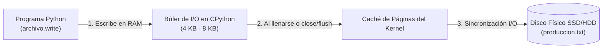
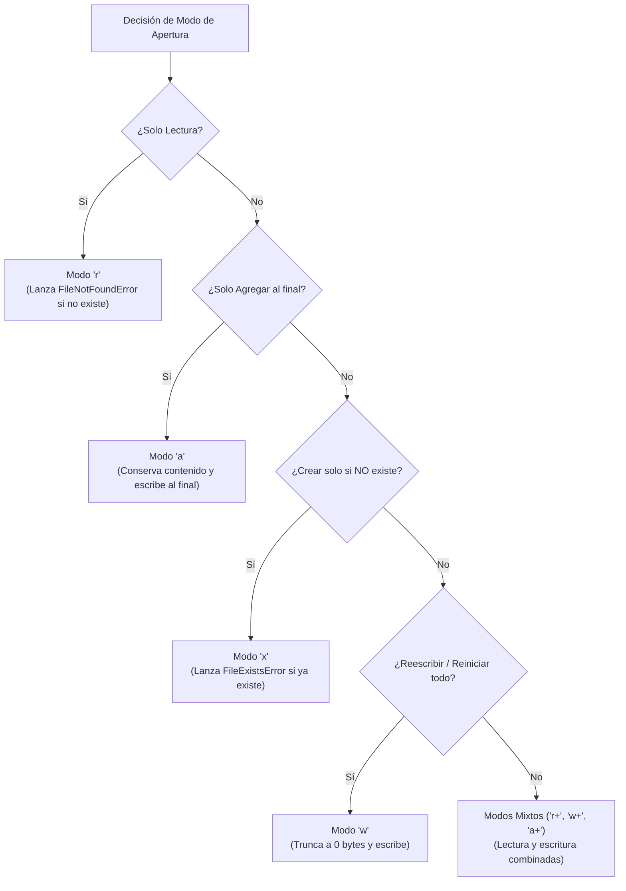
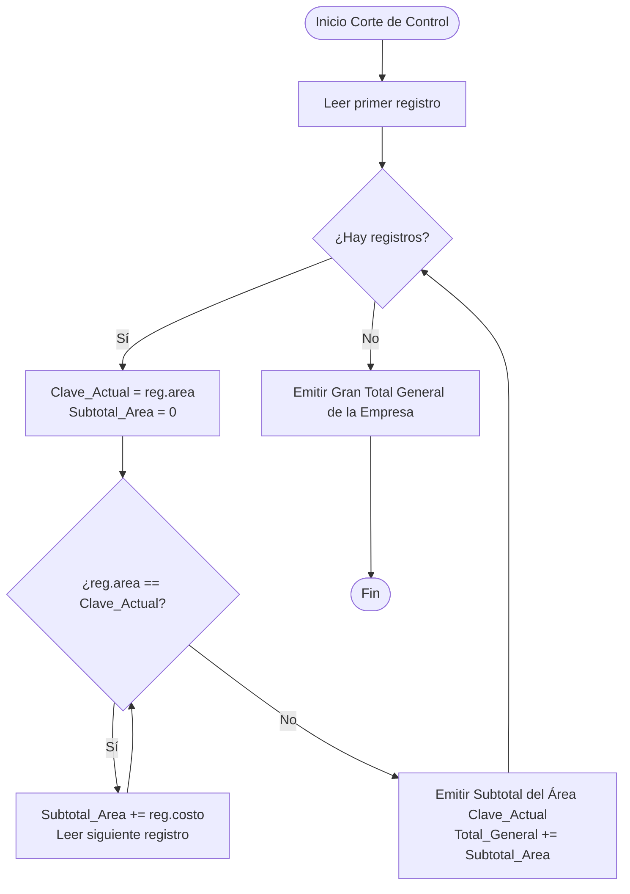
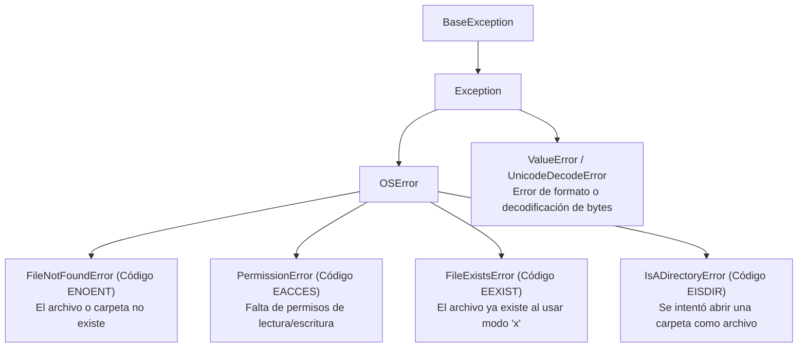

# 🗂️ Nota Maestra: Manejo y Gestión Exhaustiva de Archivos en Python

> [!NOTE] Leyenda de Trazabilidad y Demarcación de Fuentes
> * 🎓 `[Cátedra USS / Diapositivas Docente]`: Contenidos de las presentaciones de la Unidad 1, guía de control de producción y solución oficial docente de registro de ventas (`solucion_ventas.py`).
> * 📖 `[Texto Guía — FIUBA / Batista & Carlevaro]`: Fundamentos algorítmicos, descriptores de archivos, corte de control, apareo de archivos y serialización avanzada.
> * 🌐 `[Enriquecimiento Web / Documentación Oficial Python]`: Especificaciones PEP 343, estándares POSIX, I/O Buffering en CPython, codificación UTF-8 e ingeniería de software defensiva.

---

## 📑 Tabla de Contenidos

1. [1. Fundamentos Arquitectónicos de la Persistencia de Datos](#1-fundamentos-arquitectónicos-de-la-persistencia-de-datos)
2. [2. El Protocolo Context Manager (with open) y Gestión Determinista de Recursos](#2-el-protocolo-context-manager-with-open-y-gestión-determinista-de-recursos)
3. [3. Taxonomía Exhaustiva de Modos de Apertura de Archivos](#3-taxonomía-exhaustiva-de-modos-de-apertura-de-archivos)
4. [4. Anatomía y Control del Puntero de Archivo (seek y tell)](#4-anatomía-y-control-del-puntero-de-archivo-seek-y-tell)
5. [5. Estrategias de Lectura y Eficiencia de Memoria O(1)](#5-estrategias-de-lectura-y-eficiencia-de-memoria-o1)
6. [6. Formatos Delimitados, Limpieza y Mapeo Bidireccional a Diccionarios](#6-formatos-delimitados-limpieza-y-mapeo-bidireccional-a-diccionarios)
7. [7. Mecánica CRUD en Archivos Planos: Modificación y Eliminación Atómica](#7-mecánica-crud-en-archivos-planos-modificación-y-eliminación-atómica)
8. [8. Rutas Orientadas a Objetos con pathlib.Path vs os.path](#8-rutas-orientadas-a-objetos-con-pathlibpath-vs-ospath)
9. [9. Técnicas Avanzadas de Procesamiento Masivo (Corte de Control, Apareo y JSON)](#9-técnicas-avanzadas-de-procesamiento-masivo-corte-de-control-apareo-y-json)
10. [10. Casos de Estudio Integrales: Producción Industrial y Registro de Ventas](#10-casos-de-estudio-integrales-producción-industrial-y-registro-de-ventas)
11. [11. Diagnóstico, Jerarquía de Excepciones y Filosofía EAFP](#11-diagnóstico-jerarquía-de-excepciones-y-filosofía-eafp)
12. [12. Batería de Autoevaluación y Preguntas de Reflexión Resueltas](#12-batería-de-autoevaluación-y-preguntas-de-reflexión-resueltas)

---

## 1. Fundamentos Arquitectónicos de la Persistencia de Datos

### 1.1 Jerarquía de Memoria: Memoria RAM vs. Almacenamiento Secundario 🎓 🌐
En la ejecución de cualquier programa en Python, existe una distinción física y conceptual fundamental entre los dos niveles de almacenamiento del computador:

```
┌───────────────────────────────────────────────┐
│        MEMORIA PRIMARIA (RAM) — Volátil       │
│  • Latencia ultra baja (~10 - 100 ns)          │
│  • Almacena variables, listas, diccionarios   │
│  • Se destruye al terminar el proceso o apagar│
└───────────────────────┬───────────────────────┘
                        │ Operaciones de E/S
                        │ (File I/O Streams)
┌───────────────────────▼───────────────────────┐
│   ALMACENAMIENTO SECUNDARIO (SSD/HDD) — Fijo  │
│  • Latencia mayor (~10 µs en SSD, ~5 ms en HDD│
│  • Almacena archivos (.txt, .csv, .json, etc.)│
│  • PERSISTE entre reinicios y ejecuciones     │
└───────────────────────────────────────────────┘
```

> [!IMPORTANT] Principio Fundamental de Persistencia
> Las estructuras de datos en memoria (`list`, `dict`, `set`) se utilizan para la **manipulación algorítmica y procesamiento en tiempo real**. Los archivos en disco se utilizan para garantizar la **persistencia del estado** del sistema de información entre distintas ejecuciones.

### 1.2 ¿Qué es un Archivo para el Sistema Operativo? Streams y File Descriptors 📖 🌐
A nivel del Kernel (Linux, macOS, Windows), un archivo es una **secuencia lineal continua de bytes** (*stream*). Cuando un proceso solicita abrir un archivo mediante la llamada al sistema (`sys_open`), el sistema operativo:
1. Localiza los bloques físicos correspondientes en el sistema de archivos (ext4, NTFS, APFS).
2. Asigna una entrada en la tabla de archivos abiertos del proceso y devuelve un número entero no negativo denominado **Descriptor de Archivo** (*File Descriptor* en sistemas POSIX o *Handle* en Windows).
3. Mantiene un **Puntero de Archivo** (*File Pointer / Cursor*) que indica el desplazamiento exacto (*offset*) en bytes donde ocurrirá la próxima operación de lectura o escritura.

### 1.3 Búferes de Entrada/Salida (*I/O Buffering*) 📖 🌐
Escribir directamente al disco físico byte por byte es una operación de altísimo costo computacional. Por ello, la biblioteca estándar de CPython implementa **búferes en memoria**:
* Cuando ejecutas `archivo.write("texto")`, Python **no escribe de inmediato en el disco físico**; deposita los bytes en un búfer intermedio en la memoria RAM (típicamente de 4 KB u 8 KB).
* Los datos se vuelcan (*flush*) físicamente al disco cuando:
  1. El búfer se llena por completo.
  2. Se invoca explícitamente `archivo.flush()`.
  3. Se cierra el archivo mediante `archivo.close()` o al salir del bloque `with open`.



---

## 2. El Protocolo Context Manager (with open) y Gestión Determinista de Recursos

### 2.1 El Ciclo Clásico `open()` / `close()` y el Peligro de Fugas de Recursos 🎓 📖
En versiones tempranas de programación en C y Python tradicional, el manejo de archivos dependía de invocar manualmente `close()`:

```python
# ❌ ENFOQUE TRADICIONAL ANTIGUO (Propenso a fallas y bloqueos)
archivo = open("datos.txt", "r", encoding="utf-8")
contenido = archivo.read()
# Si ocurre una excepción entre open() y close(), esta línea NUNCA se ejecuta:
archivo.close()
```

Si ocurre un error inesperado (como `ValueError`, `ZeroDivisionError` o corte de energía), el descriptor de archivo queda abierto en el Kernel, generando una **fuga de descriptores** (*File Descriptor Leak*) que puede bloquear el archivo para otros procesos o agotar el límite de archivos del sistema operativo (`ulimit -n`).

### 2.2 Mecánica Interna del Context Manager (`PEP 343`) 📖 🌐
La instrucción `with` implementa el patrón **Context Manager** formalizado en la especificación **PEP 343**:

```python
# ✅ ENFOQUE MODERNO Y ROBUSTO (Administrador de Contexto)
with open("datos/produccion.txt", "r", encoding="utf-8") as archivo:
    contenido = archivo.read()
# Al salir de la sangría, el archivo se cierra de forma INCONDICIONAL.
```

**Mecánica de Ejecución Interna:**
1. Al entrar al bloque `with`, Python invoca automáticamente el método dunder `archivo.__enter__()`, que retorna el propio objeto archivo.
2. Al finalizar el bloque (ya sea por término normal, un `return` anticipado o una excepción `Exception`), Python invoca indefectiblemente `archivo.__exit__(exc_type, exc_val, exc_tb)`.
3. El método `__exit__` ejecuta internamente `flush()` y `close()`, liberando el descriptor en el Kernel incluso si el programa colapsa.

### 2.3 El Parámetro `encoding="utf-8"` y la Traducción Universal de Saltos (`newline`) 🎓 🌐
* **Codificación UTF-8:** Define cómo se traducen los caracteres tipográficos a secuencias de bytes. Omitir `encoding="utf-8"` hace que Python utilice la codificación regional por defecto (`locale.getpreferredencoding()`), la cual en Windows suele ser `cp1252` o `latin-1`, provocando errores inmediatos `UnicodeDecodeError` al procesar tildes (`á`, `é`), eñes (`ñ`) o caracteres especiales.
* **Saltos de Línea Universales:** En Linux y macOS el salto de línea es `\n` (*Line Feed*, `LF`), mientras que en Windows es `\r\n` (*Carriage Return + Line Feed*, `CRLF`). Por defecto, en modo texto Python normaliza automáticamente todos los saltos a `\n` al leer, y los traduce al formato nativo del sistema operativo al escribir.

---

## 3. Taxonomía Exhaustiva de Modos de Apertura de Archivos

Al invocar `open(ruta, modo, encoding="utf-8")`, el parámetro `modo` define la intención operativa, los permisos de lectura/escritura y el comportamiento del puntero:

### 3.1 Tabla Maestra Comparativa de los 14 Modos de Apertura 🎓 📖 🌐

| Modo | Nombre Operativo | Lectura | Escritura | ¿Crea archivo si no existe? | Comportamiento con Contenido Existente | Posición Inicial del Puntero |
| :---: | :--- | :---: | :---: | :---: | :--- | :---: |
| `'r'` | Lectura de texto | ✅ Sí | ❌ No | ❌ Lanza `FileNotFoundError` | Preserva el contenido intacto | Inicio (byte 0) |
| `'w'` | Escritura de texto | ❌ No | ✅ Sí | ✅ Sí lo crea | ⚠️ **TRUNCA A 0 BYTES (Borra todo de inmediato)** | Inicio (byte 0) |
| `'a'` | Anexar texto (*Append*) | ❌ No | ✅ Sí | ✅ Sí lo crea | ✅ **Preserva el contenido** | **Final del archivo** |
| `'x'` | Creación exclusiva texto | ❌ No | ✅ Sí | ✅ Sí lo crea | ⚠️ **Lanza `FileExistsError` si ya existe** | Inicio (byte 0) |
| `'r+'`| Lectura y actualización | ✅ Sí | ✅ Sí | ❌ Lanza `FileNotFoundError` | ✅ **Preserva el contenido** | Inicio (byte 0) |
| `'w+'`| Escritura y lectura | ✅ Sí | ✅ Sí | ✅ Sí lo crea | ⚠️ **TRUNCA A 0 BYTES (Borra todo al abrir)** | Inicio (byte 0) |
| `'a+'`| Anexar y lectura | ✅ Sí | ✅ Sí | ✅ Sí lo crea | ✅ **Preserva el contenido** | Final (escrituras siempre al final) |
| `'rb'`| Lectura binaria | ✅ Sí | ❌ No | ❌ Lanza `FileNotFoundError` | Preserva bytes intactos | Inicio (byte 0) |
| `'wb'`| Escritura binaria | ❌ No | ✅ Sí | ✅ Sí lo crea | ⚠️ **TRUNCA A 0 BYTES** | Inicio (byte 0) |
| `'ab'`| Anexar binario | ❌ No | ✅ Sí | ✅ Sí lo crea | ✅ **Preserva bytes anteriores** | Final del archivo |
| `'xb'`| Creación exclusiva binaria | ❌ No | ✅ Sí | ✅ Sí lo crea | ⚠️ **Lanza `FileExistsError`** | Inicio (byte 0) |
| `'r+b'`| Lectura/escritura binaria | ✅ Sí | ✅ Sí | ❌ Lanza `FileNotFoundError` | ✅ **Preserva bytes anteriores** | Inicio (byte 0) |
| `'w+b'`| Escritura/lectura binaria | ✅ Sí | ✅ Sí | ✅ Sí lo crea | ⚠️ **TRUNCA A 0 BYTES** | Inicio (byte 0) |
| `'a+b'`| Anexar/lectura binaria | ✅ Sí | ✅ Sí | ✅ Sí lo crea | ✅ **Preserva bytes anteriores** | Final del archivo |

> [!CAUTION] Distinción Crítica entre `'r+'`, `'w+'` y `'a+'`
> * `'r+'`: Abre para lectura y escritura sin borrar nada. La escritura sobreescribe byte a byte en la posición actual del cursor.
> * `'w+'`: Abre para lectura y escritura, pero **destruye de inmediato todo el contenido previo** dejándolo en blanco.
> * `'a+'`: Abre para lectura y anexar. Aunque muevas el cursor con `.seek()`, **cualquier llamada a `.write()` forzará la escritura al final del archivo** por diseño del Kernel.



---

## 4. Anatomía y Control del Puntero de Archivo (seek y tell)

### 4.1 Localización del Cursor con `archivo.tell()` 📖 🌐
El método `.tell()` retorna un número entero que indica la **posición actual del puntero** medida en bytes desde el inicio del archivo:

```python
with open("datos.txt", "w", encoding="utf-8") as f:
    f.write("Hola")
    posicion = f.tell()
    print(f"Puntero tras escribir 'Hola': byte {posicion}")  # Byte 4
```

### 4.2 Desplazamiento del Cursor con `archivo.seek(offset, whence)` 📖 🌐
El método `.seek()` permite mover manualmente el cursor para releer o sobreescribir datos:

```python
import os

# archivo.seek(offset, whence)
# whence = 0 (os.SEEK_SET) -> Desde el inicio del archivo (por defecto)
# whence = 1 (os.SEEK_CUR) -> Desde la posición actual
# whence = 2 (os.SEEK_END) -> Desde el final del archivo
```

```python
with open("ejemplo.txt", "w+", encoding="utf-8") as f:
    f.write("ABCDEFGHIJ")
    
    # Mover el puntero al byte 0 (inicio) para leer lo recién escrito:
    f.seek(0, os.SEEK_SET)
    print("Lectura completa:", f.read())  # "ABCDEFGHIJ"
    
    # Mover el puntero al byte 3:
    f.seek(3, os.SEEK_SET)
    print("Lectura desde byte 3:", f.read())  # "DEFGHIJ"
```

> [!WARNING] Precaución con `seek()` en Archivos de Texto UTF-8 Multibyte
> En archivos de texto (`str`), caracteres como tildes (`á`) o letras especiales ocupan **2 o más bytes**. Si realizas un `seek()` a una posición intermedia de un carácter multibyte, Python lanzará un `UnicodeDecodeError` al intentar decodificar un byte incompleto. En modo texto, utiliza `seek(0)` o posiciones exactas devueltas previamente por `tell()`.

---

## 5. Estrategias de Lectura y Eficiencia de Memoria O(1)

### 5.1 Comparativa de Métodos de Lectura 🎓 📖

```python
# 1. archivo.read() -> Carga TODO el contenido en una única cadena str en memoria RAM.
# ⚠️ PELIGROSO en archivos grandes (ej. 5 GB agotarán la memoria RAM).
with open("datos.txt", "r", encoding="utf-8") as f:
    todo_el_texto: str = f.read()

# 2. archivo.readline() -> Lee UNA sola línea hasta encontrar '\n' o el final del archivo (EOF).
with open("datos.txt", "r", encoding="utf-8") as f:
    primera_linea: str = f.readline()

# 3. archivo.readlines() -> Lee todas las líneas y las almacena en una lista list[str].
# ⚠️ Sigue cargando todo el archivo completo en memoria RAM en forma de lista.
with open("datos.txt", "r", encoding="utf-8") as f:
    todas_las_lineas: list[str] = f.readlines()
```

### 5.2 La Regla de Oro: Iterador Perezoso `for linea in archivo` 🎓 📖 🌐
La forma idiomática y profesional en Python para recorrer cualquier archivo de texto es iterar directamente sobre el objeto archivo:

```python
# ✅ RECORRIDO EN STREAMING CON MEMORIA O(1)
with open("datos/produccion.txt", "r", encoding="utf-8") as archivo:
    for numero_linea, linea in enumerate(archivo, start=1):
        # Procesa una sola línea a la vez. Memoria RAM constante e insignificante.
        print(f"Línea {numero_linea}: {linea.strip()}")
```

> [!TIP] ¿Por qué es óptimo?
> El objeto archivo en Python implementa el protocolo de iterador (`__iter__` y `__next__`). Al usar un ciclo `for`, Python carga las líneas por bloques mediante su búfer interno, entregando **una línea a la vez**. Puedes procesar un archivo de 100 GB en un computador con 2 GB de RAM sin experimentar saturación de memoria.

---

## 6. Formatos Delimitados, Limpieza y Mapeo Bidireccional a Diccionarios

### 6.1 El Problema del Salto de Línea y la Dupla `.strip()` + `.split(";")` 🎓 📖
Cuando se lee una línea de un archivo de texto plano, el final contiene el carácter de salto de línea `\n` (o `\r\n`):

```python
linea_cruda: str = "1;Silla Ergonomica;Muebles;15;25000;Pendiente\n"

# Paso 1: .strip() elimina espacios periféricos y el salto '\n' final
linea_limpia: str = linea_cruda.strip()
# Resultado: "1;Silla Ergonomica;Muebles;15;25000;Pendiente"

# Paso 2: .split(";") divide la cadena por el delimitador elegido
campos: list[str] = linea_limpia.split(";")
# Resultado: ['1', 'Silla Ergonomica', 'Muebles', '15', '25000', 'Pendiente']
```

> [!IMPORTANT] ¿Por qué nunca omitir `.strip()` antes de `.split()`?
> Si omites `.strip()`, el último campo retendrá el salto de línea (ej. `'Pendiente\n'`). Al intentar convertir campos cuantitativos finales a enteros (`int('25000\n')` puede tolerarse, pero comparaciones de cadenas `if estado == 'Pendiente':` fallarán silenciosamente porque `'Pendiente\n' != 'Pendiente'`).

### 6.2 Sanitización de Entradas y Prevención de Inyección de Delimitadores 🎓 🌐
En el código de cátedra docente (`solucion_ventas.py`), se introduce una técnica fundamental para evitar la corrupción del archivo delimitado:
* Si el usuario escribe `"Gómez; Juan"` en el campo de cliente o producto, el delimitador `;` creará una columna extra fantasma al guardar el registro en el archivo de texto, rompiendo `len(datos) == 6` en la lectura.
* Si el usuario ingresa caracteres de control como saltos de línea (`\n` o `\r`), el registro se partirá en dos líneas físicas distintas en el archivo.

**Patrón de Sanitización Docente (`solicitar_texto`):**
```python
SEPARADOR = ";"

def solicitar_texto(mensaje: str) -> str:
    """Solicita un texto no vacío y sanitiza delimitadores y saltos de línea."""
    while True:
        texto = input(mensaje).strip()
        if texto == "":
            print("Error: este dato no puede quedar vacío.")
        elif SEPARADOR in texto or "\n" in texto or "\r" in texto:
            print(f"Error: no puede utilizar '{SEPARADOR}' ni saltos de línea.")
        else:
            return texto
```

### 6.3 Validación Defensiva GIGO (*Garbage In, Garbage Out*) 🎓 📖 🌐
En sistemas de producción, nunca se debe confiar ciegamente en que el archivo de texto esté bien formado. Se debe aplicar validación exhaustiva:

```python
from typing import TypedDict

class Producto(TypedDict):
    id: int
    producto: str
    area: str
    cantidad: int
    valor_unitario: int
    estado: str

def convertir_linea_a_diccionario(linea: str) -> Producto:
    """Parsea y valida defensivamente una línea delimitada por ';'.
    
    Lanza ValueError con mensajes explicativos si la estructura o tipos fallan.
    """
    linea_limpia = linea.strip()
    if not linea_limpia:
        raise ValueError("Línea vacía o compuesta únicamente de espacios.")
        
    campos = [c.strip() for c in linea_limpia.split(";")]
    if len(campos) != 6:
        raise ValueError(f"Registro inválido: se esperaban 6 campos, se recibieron {len(campos)}.")
        
    # Conversión tipada con captura de anomalías
    try:
        identificador = int(campos[0])
        cantidad = int(campos[3])
        valor_unitario = int(campos[4])
    except ValueError as error:
        raise ValueError(f"Error de tipos numéricos en la línea: {error}") from error
        
    if identificador <= 0:
        raise ValueError("El identificador ID debe ser estrictamente positivo (> 0).")
    if not campos[1] or not campos[2] or not campos[5]:
        raise ValueError("Los campos de texto (producto, área, estado) no pueden estar vacíos.")
    if cantidad <= 0:
        raise ValueError("La cantidad a producir debe ser mayor que cero.")
    if valor_unitario < 0:
        raise ValueError("El valor unitario no puede ser negativo.")
        
    return {
        "id": identificador,
        "producto": campos[1],
        "area": campos[2],
        "cantidad": cantidad,
        "valor_unitario": valor_unitario,
        "estado": campos[5]
    }
```

### 6.4 Validación Cruzada de Integridad Aritmética (*Cross-Field Validation*) 🎓
Cuando un archivo almacena campos calculados (como el campo `total` en `solucion_ventas.py`), un lector robusto debe verificar que los valores almacenados sean coherentes con la lógica de negocio:

```python
def calcular_total(valor_unitario: int, cantidad: int) -> int:
    return valor_unitario * cantidad

# Durante la lectura defensiva del archivo:
# Si alguien editó manualmente el archivo y alteró el total:
if total != calcular_total(valor_unitario, cantidad):
    print(f"Advertencia: línea {numero_linea} tiene un total inconsistente ({total} != {valor_unitario * cantidad}).")
    # Se omite la línea corrupta o se repara automáticamente.
```

### 6.5 Generación de Marcas Temporales con `datetime.date.today().isoformat()` 🎓 🌐
Para registrar automáticamente la fecha de cada transacción sin depender de la entrada manual del usuario:

```python
from datetime import date

# Obtiene la fecha actual del sistema en estándar internacional ISO 8601 (YYYY-MM-DD)
fecha_actual = date.today().isoformat()
print(f"Fecha registrada: {fecha_actual}")  # Ej: '2026-08-12'
```

### 6.6 Mapeo Bidireccional: Memoria $\leftrightarrow$ Archivo Persistente 🎓


```python
def convertir_diccionario_a_linea(prod: Producto) -> str:
    """Serializa un diccionario a formato plano delimitado por ';' sin salto final."""
    # Validación contra inyección de delimitadores
    if any(";" in str(prod[campo]) for campo in ("producto", "area", "estado")):
        raise ValueError("Los campos de texto no pueden contener el carácter delimitador ';'.")
        
    return f"{prod['id']};{prod['producto'].strip()};{prod['area'].strip()};{prod['cantidad']};{prod['valor_unitario']};{prod['estado'].strip()}"
```

---

## 7. Mecánica CRUD en Archivos Planos: Modificación y Eliminación Atómica

### 7.1 La Naturaleza Física del Almacenamiento Secuencial 📖 🌐
Una de las dudas más frecuentes en programación es: **"¿Por qué no existe una función `archivo.delete_line(3)` o `archivo.replace_word('Mesa', 'Silla')`?"**

**Explicación Fundamental:**
En un archivo de texto en disco, los bytes están almacenados contiguamente en sectores físicos. Si la línea 3 mide 30 bytes y la reemplazas por un texto de 45 bytes, **los 15 bytes adicionales sobreescribirán y corromperán el inicio de la línea 4**. No se pueden "empujar" físicamente los bytes subsecuentes en un archivo plano sin reescribir todo el contenido posterior.

### 7.2 Patrón 1: Carga en Memoria $\to$ Modificación $\to$ Reescritura Total (`'w'`) 🎓
Para archivos de tamaño pequeño a moderado (miles de registros, órdenes del semestre, inventarios locales), el patrón estándar es:

```python
def actualizar_estado_en_memoria(ruta_archivo: str, id_objetivo: int, nuevo_estado: str) -> bool:
    """1. Lee todo a lista de diccionarios. 2. Modifica en memoria. 3. Reescribe en 'w'."""
    # 1. Cargar
    productos: list[Producto] = []
    with open(ruta_archivo, "r", encoding="utf-8") as f:
        for linea in f:
            if linea.strip():
                productos.append(convertir_linea_a_diccionario(linea))
                
    # 2. Modificar
    encontrado = False
    for p in productos:
        if p["id"] == id_objetivo:
            p["estado"] = nuevo_estado
            encontrado = True
            break
            
    if not encontrado:
        return False
        
    # 3. Reescribir de forma atómica/controlada en modo 'w'
    with open(ruta_archivo, "w", encoding="utf-8") as f:
        for p in productos:
            f.write(convertir_diccionario_a_linea(p) + "\n")
            
    return True
```

### 7.3 Patrón 2: Streaming con Archivo Temporal y Reemplazo Atómico (`os.replace`) 📖 🌐
Para sistemas donde el archivo puede ser grande o donde un corte de energía durante la escritura en modo `'w'` destruiría los datos (*Race Conditions* / *Data Corruption*), se aplica el **Patrón de Reemplazo Atómico**:

```python
import os
import tempfile
from pathlib import Path

def eliminar_registro_atomico(ruta_archivo: Path, id_a_eliminar: int) -> bool:
    """Elimina un registro mediante un archivo temporal y reemplazo atómico en el SO."""
    encontrado = False
    carpeta = ruta_archivo.parent
    
    # Crear archivo temporal en la misma carpeta para garantizar que esté en el mismo sistema de archivos
    with open(ruta_archivo, "r", encoding="utf-8") as origen, \
         tempfile.NamedTemporaryFile("w", dir=carpeta, delete=False, encoding="utf-8") as temp_file:
        
        temp_path = Path(temp_file.name)
        
        for linea in origen:
            if not linea.strip():
                continue
            prod = convertir_linea_a_diccionario(linea)
            if prod["id"] == id_a_eliminar:
                encontrado = True  # Omitimos escribir esta línea en el temporal
            else:
                temp_file.write(convertir_diccionario_a_linea(prod) + "\n")
                
    if encontrado:
        # os.replace es una operación ATÓMICA a nivel del Kernel POSIX/Windows
        os.replace(temp_path, ruta_archivo)
        return True
    else:
        # Si no se encontró, eliminamos el archivo temporal sobrante
        temp_path.unlink(missing_ok=True)
        return False
```

---

## 8. Rutas Orientadas a Objetos con pathlib.Path vs os.path

### 8.1 Comparativa de Paradigmas 📖 🌐
Python 3.4 introdujo el módulo `pathlib` (**PEP 428**), que reemplaza la manipulación arcaica de cadenas de texto con `os.path` por objetos con métodos nativos:

| Operación | Enfoque Clásico (`os` / `os.path`) | Enfoque Moderno (`pathlib.Path`) |
| :--- | :--- | :--- |
| **Construir Ruta** | `os.path.join("datos", "ventas.txt")` | `Path("datos") / "ventas.txt"` (Operador `/`) |
| **Crear Carpeta** | `if not os.path.exists("d"): os.makedirs("d")` | `Path("datos").mkdir(parents=True, exist_ok=True)` |
| **¿Existe?** | `os.path.exists(ruta)` | `ruta.exists()` |
| **¿Es Archivo?** | `os.path.isfile(ruta)` | `ruta.is_file()` |
| **Borrar Archivo** | `os.remove(ruta)` | `ruta.unlink(missing_ok=True)` |
| **Leer Todo** | `with open(ruta) as f: f.read()` | `ruta.read_text(encoding="utf-8")` |
| **Escribir Todo** | `with open(ruta, "w") as f: f.write(t)` | `ruta.write_text(t, encoding="utf-8")` |

```python
from pathlib import Path

# Definición de constantes de ruta seguras y multiplataforma
CARPETA_DATOS = Path("datos")
ARCHIVO_PRODUCCION = CARPETA_DATOS / "produccion.txt"

# Preparación robusta en una sola línea:
CARPETA_DATOS.mkdir(parents=True, exist_ok=True)
if not ARCHIVO_PRODUCCION.exists():
    ARCHIVO_PRODUCCION.touch()  # Crea el archivo vacío si no existe
```

---

## 9. Técnicas Avanzadas de Procesamiento Masivo (Corte de Control, Apareo y JSON)

### 9.1 Técnica de Corte de Control (*Control Break Processing*) 📖
El **Corte de Control** es un algoritmo clásico de las Ciencias de la Computación (originado en procesamiento por lotes en Mainframes y consolidado en el texto de **FIUBA**) para procesar archivos masivos ordenados por una clave sin cargar el archivo a la RAM:

**Precondición:** El archivo debe estar previamente ordenado por la clave de corte (por ejemplo, ordenado por `area`).



```python
def corte_de_control_por_area(ruta_ordenada: Path) -> None:
    """Calcula subtotales por área en O(1) de memoria RAM sobre un archivo ordenado."""
    if not ruta_ordenada.exists():
        print("El archivo no existe.")
        return

    with ruta_ordenada.open("r", encoding="utf-8") as f:
        linea = f.readline()
        if not linea:
            print("Archivo vacío.")
            return

        total_general = 0
        prod_actual = convertir_linea_a_diccionario(linea)

        while linea:
            area_actual = prod_actual["area"]
            subtotal_area = 0
            unidades_area = 0

            print(f"\n--- PROCESANDO ÁREA: {area_actual} ---")

            while linea and prod_actual["area"] == area_actual:
                costo_orden = prod_actual["cantidad"] * prod_actual["valor_unitario"]
                subtotal_area += costo_orden
                unidades_area += prod_actual["cantidad"]

                print(f"  • ID {prod_actual['id']}: {prod_actual['producto']} "
                      f"({prod_actual['cantidad']} u. x ${prod_actual['valor_unitario']:,} = ${costo_orden:,})")

                linea = f.readline()
                if linea:
                    prod_actual = convertir_linea_a_diccionario(linea)

            print(f"Subtotal {area_actual}: {unidades_area} unidades | Costo: ${subtotal_area:,}")
            total_general += subtotal_area

        print(f"\n{'='*50}")
        print(f"GRAN TOTAL GENERAL DE PRODUCCIÓN: ${total_general:,}")
        print(f"{'='*50}")
```

### 9.2 Apareo de Archivos (*Two-Way File Merge*) 📖
Permite combinar dos archivos secuenciales ordenados en un único archivo de salida ordenado con complejidad temporal óptima $\mathcal{O}(N + M)$ y memoria $\mathcal{O}(1)$:

```python
def aparear_archivos_produccion(ruta_a: Path, ruta_b: Path, ruta_salida: Path) -> None:
    """Mezcla dos archivos ordenados por ID produciendo una salida única consolidada."""
    with ruta_a.open("r", encoding="utf-8") as fa, \
         ruta_b.open("r", encoding="utf-8") as fb, \
         ruta_salida.open("w", encoding="utf-8") as f_out:

        linea_a = fa.readline()
        linea_b = fb.readline()

        while linea_a and linea_b:
            prod_a = convertir_linea_a_diccionario(linea_a)
            prod_b = convertir_linea_a_diccionario(linea_b)

            if prod_a["id"] <= prod_b["id"]:
                f_out.write(convertir_diccionario_a_linea(prod_a) + "\n")
                linea_a = fa.readline()
            else:
                f_out.write(convertir_diccionario_a_linea(prod_b) + "\n")
                linea_b = fb.readline()

        # Vaciar remanentes
        while linea_a:
            f_out.write(linea_a if linea_a.endswith("\n") else linea_a + "\n")
            linea_a = fa.readline()

        while linea_b:
            f_out.write(linea_b if linea_b.endswith("\n") else linea_b + "\n")
            linea_b = fb.readline()
```

### 9.3 Serialización Estructurada con JSON (`json.dump` / `json.load`) 📖 🌐
Cuando los registros poseen estructuras jerárquicas complejas (listas anidadas, diccionarios dentro de diccionarios), el formato delimitado por `;` se vuelve insuficiente. Se utiliza el estándar **JSON** (*JavaScript Object Notation*):

```python
import json

def exportar_a_json(productos: list[Producto], ruta_json: Path) -> None:
    """Serializa la lista de diccionarios a formato JSON legible."""
    with ruta_json.open("w", encoding="utf-8") as f:
        # indent=4 formatea el JSON con sangría visual elegante
        # ensure_ascii=False permite conservar tildes y caracteres especiales directamente
        json.dump(productos, f, indent=4, ensure_ascii=False)

def importar_de_json(ruta_json: Path) -> list[Producto]:
    """Carga y reconstruye la estructura completa de diccionarios desde JSON."""
    with ruta_json.open("r", encoding="utf-8") as f:
        return json.load(f)
```

---

## 10. Casos de Estudio Integrales: Producción Industrial y Registro de Ventas

A continuación se analizan los dos sistemas de referencia del curso, ilustrando dos arquitecturas de interacción en consola:

### 10.1 Caso de Estudio A: Sistema Continuo de Control de Órdenes de Producción 🎓

```python
"""Módulo de Control de Órdenes de Producción — Taller de Programación II.

Implementa un CRUD persistente sobre archivo plano delimitado por ';'
cumpliendo con validaciones GIGO y formateo tabular en consola.
"""

from pathlib import Path
from typing import Final, TypedDict

class Producto(TypedDict):
    id: int
    producto: str
    area: str
    cantidad: int
    valor_unitario: int
    estado: str

CARPETA_DATOS: Final[Path] = Path("datos")
ARCHIVO_PRODUCCION: Final[Path] = CARPETA_DATOS / "produccion.txt"
ESTADOS_PERMITIDOS: Final[tuple[str, ...]] = ("Pendiente", "En Proceso", "Completada", "Cancelada")

def convertir_linea_a_diccionario(linea: str) -> Producto:
    """Parsea una línea delimitada por ';' y valida su estructura y tipos."""
    linea_limpia = linea.strip()
    if not linea_limpia:
        raise ValueError("Línea vacía.")
    campos = [c.strip() for c in linea_limpia.split(";")]
    if len(campos) != 6:
        raise ValueError(f"Se esperaban 6 campos, se recibieron {len(campos)}.")
    return {
        "id": int(campos[0]),
        "producto": campos[1],
        "area": campos[2],
        "cantidad": int(campos[3]),
        "valor_unitario": int(campos[4]),
        "estado": campos[5],
    }

def convertir_diccionario_a_linea(prod: Producto) -> str:
    """Serializa un diccionario a formato plano delimitado por ';'."""
    if any(";" in str(prod[c]) for c in ("producto", "area", "estado")):
        raise ValueError("Los campos no pueden contener ';'.")
    return f"{prod['id']};{prod['producto']};{prod['area']};{prod['cantidad']};{prod['valor_unitario']};{prod['estado']}"

def preparar_archivo() -> None:
    """Garantiza la existencia de la carpeta y el archivo persistente."""
    CARPETA_DATOS.mkdir(parents=True, exist_ok=True)
    with ARCHIVO_PRODUCCION.open("a", encoding="utf-8"):
        pass

def leer_productos() -> list[Producto]:
    """Recupera todas las órdenes válidas del archivo."""
    preparar_archivo()
    productos: list[Producto] = []
    with ARCHIVO_PRODUCCION.open("r", encoding="utf-8") as archivo:
        for num_linea, linea in enumerate(archivo, start=1):
            if not linea.strip():
                continue
            try:
                productos.append(convertir_linea_a_diccionario(linea))
            except ValueError as err:
                print(f"Advertencia: línea {num_linea} omitida ({err})")
    return productos

def reescribir_archivo(productos: list[Producto]) -> None:
    """Reescribe el archivo completo de forma controlada en modo 'w'."""
    preparar_archivo()
    with ARCHIVO_PRODUCCION.open("w", encoding="utf-8") as archivo:
        for p in productos:
            archivo.write(convertir_diccionario_a_linea(p) + "\n")

def mostrar_productos(productos: list[Producto]) -> None:
    """Despliega una tabla formateada en consola."""
    print(f"\n{'ID':>4} | {'PRODUCTO':<22} | {'ÁREA':<14} | {'CANTIDAD':>8} | {'VALOR UNIT.':>12} | {'ESTADO':<12}")
    print("-" * 85)
    if not productos:
        print("No existen órdenes registradas.")
        print("-" * 85)
        return
    for p in productos:
        print(f"{p['id']:>4} | {p['producto']:<22} | {p['area']:<14} | {p['cantidad']:>8,}"
              f" | ${p['valor_unitario']:>11,} | {p['estado']:<12}")
    print("-" * 85)

def calcular_costos_produccion(productos: list[Producto]) -> None:
    """Calcula y muestra subtotales y el costo total general de la planta."""
    print("\nDESGLOSE DE COSTOS DE PRODUCCIÓN")
    print("-" * 75)
    total_general = 0
    for p in productos:
        subtotal = p["cantidad"] * p["valor_unitario"]
        total_general += subtotal
        print(f"ID {p['id']:>4} | {p['producto']:<22} | {p['cantidad']:>6,} u. x ${p['valor_unitario']:>8,} = ${subtotal:>12,}")
    print("-" * 75)
    print(f"Costo Total Estimado de Producción: ${total_general:,} CLP")

def buscar_productos(productos: list[Producto]) -> None:
    """Filtra órdenes por área o estado de forma insensible a mayúsculas."""
    if not productos:
        print("No hay órdenes disponibles.")
        return
    criterio = input("Buscar por [area/estado]: ").strip().lower()
    if criterio not in {"area", "estado"}:
        print("Criterio inválido.")
        return
    termino = input(f"Ingrese {criterio} a buscar: ").strip().lower()
    resultados = [p for p in productos if p[criterio].lower() == termino]
    mostrar_productos(resultados)

def actualizar_estado(productos: list[Producto]) -> None:
    """Permite seleccionar una orden por ID y cambiar su estado en memoria y disco."""
    if not productos:
        print("No hay órdenes.")
        return
    mostrar_productos(productos)
    try:
        id_obj = int(input("Ingrese ID de la orden a actualizar: ").strip())
    except ValueError:
        print("ID inválido.")
        return
    orden = next((p for p in productos if p["id"] == id_obj), None)
    if not orden:
        print(f"Orden ID {id_obj} no encontrada.")
        return
    print(f"Estados válidos: {', '.join(ESTADOS_PERMITIDOS)}")
    nuevo_estado = input("Nuevo estado: ").strip()
    if nuevo_estado not in ESTADOS_PERMITIDOS:
        print("Estado no reconocido.")
        return
    orden["estado"] = nuevo_estado
    reescribir_archivo(productos)
    print(f"✅ Orden ID {id_obj} actualizada a '{nuevo_estado}'.")

def eliminar_producto(productos: list[Producto]) -> None:
    """Elimina una orden confirmada por ID y sincroniza el archivo en disco."""
    if not productos:
        print("No hay órdenes.")
        return
    mostrar_productos(productos)
    try:
        id_obj = int(input("Ingrese ID de la orden a eliminar: ").strip())
    except ValueError:
        print("ID inválido.")
        return
    pos = next((i for i, p in enumerate(productos) if p["id"] == id_obj), None)
    if pos is None:
        print(f"Orden ID {id_obj} no encontrada.")
        return
    conf = input(f"¿Confirma eliminar la orden ID {id_obj}? (s/n): ").strip().lower()
    if conf in {"s", "si"}:
        productos.pop(pos)
        reescribir_archivo(productos)
        print(f"✅ Orden ID {id_obj} eliminada exitosamente.")
    else:
        print("Operación cancelada.")

def agregar_orden_interactiva() -> None:
    """Solicita datos al usuario con validaciones y anexa la orden en modo 'a'."""
    productos = leer_productos()
    siguiente_id = max((p["id"] for p in productos), default=0) + 1
    
    print(f"\n--- REGISTRAR NUEVA ORDEN (ID Asignado: {siguiente_id}) ---")
    while True:
        nombre = input("Nombre del producto: ").strip()
        if nombre and ";" not in nombre:
            break
        print("Error: nombre no puede estar vacío ni contener ';'.")
        
    while True:
        area = input("Área de producción (ej. Muebles, Oficina): ").strip()
        if area and ";" not in area:
            break
        print("Error: área no puede estar vacía ni contener ';'.")
        
    while True:
        try:
            cantidad = int(input("Cantidad de unidades (> 0): ").strip())
            if cantidad > 0:
                break
            print("Error: la cantidad debe ser mayor a cero.")
        except ValueError:
            print("Error: debe ingresar un número entero válido.")
            
    while True:
        try:
            valor = int(input("Valor unitario en CLP (>= 0): ").strip())
            if valor >= 0:
                break
            print("Error: el valor no puede ser negativo.")
        except ValueError:
            print("Error: debe ingresar un número entero válido.")
            
    nueva_orden: Producto = {
        "id": siguiente_id,
        "producto": nombre,
        "area": area,
        "cantidad": cantidad,
        "valor_unitario": valor,
        "estado": "Pendiente"
    }
    
    with ARCHIVO_PRODUCCION.open("a", encoding="utf-8") as f:
        f.write(convertir_diccionario_a_linea(nueva_orden) + "\n")
        
    print(f"✅ Orden {siguiente_id} guardada exitosamente en disco.")
```

---

### 10.2 Caso de Estudio B: Registro de Ventas de la Feria y Lotes Fijos (`solucion_ventas.py`) 🎓

Este caso modela el código de cátedra oficial entregado por el profesor. Presenta una arquitectura procedural limpia basada en **funciones auxiliares especializadas** y un **bucle de captura por lote fijo** (`for numero in range(3)`):

```python
"""Solución oficial de cátedra: Registro de ventas con archivos.

Cada venta se crea primero como un diccionario y luego se guarda en ventas.txt.
Los montos se trabajan como números enteros en pesos chilenos.
"""

import os
from datetime import date

ARCHIVO_VENTAS = "ventas.txt"
SEPARADOR = ";"

def solicitar_texto(mensaje):
    """Solicita un texto que no esté vacío ni rompa el formato del archivo."""
    while True:
        texto = input(mensaje).strip()
        if texto == "":
            print("Error: este dato no puede quedar vacío.")
        elif SEPARADOR in texto or "\n" in texto or "\r" in texto:
            print(f"Error: no puede utilizar '{SEPARADOR}' ni saltos de línea.")
        else:
            return texto

def solicitar_entero(mensaje):
    """Solicita un número entero mayor que cero."""
    while True:
        entrada = input(mensaje).strip()
        try:
            numero = int(entrada)
        except ValueError:
            print("Error: debe ingresar un número entero.")
            continue
        if numero <= 0:
            print("Error: el número debe ser mayor que cero.")
        else:
            return numero

def calcular_total(valor_unitario, cantidad):
    """Calcula el total de una venta en pesos enteros."""
    return valor_unitario * cantidad

def solicitar_venta():
    """Solicita los datos y construye un diccionario venta con fecha automática."""
    print("\n--- NUEVA VENTA ---")
    nombre_cliente = solicitar_texto("Nombre del cliente: ")
    producto = solicitar_texto("Producto: ")
    valor_unitario = solicitar_entero("Valor unitario en pesos: ")
    cantidad = solicitar_entero("Cantidad: ")
    total = calcular_total(valor_unitario, cantidad)
    fecha = date.today().isoformat()

    return {
        "nombre_cliente": nombre_cliente,
        "producto": producto,
        "valor_unitario": valor_unitario,
        "cantidad": cantidad,
        "total": total,
        "fecha": fecha
    }

def guardar_venta(venta):
    """Convierte un diccionario en una línea y la agrega al archivo en modo 'a'."""
    with open(ARCHIVO_VENTAS, "a", encoding="utf-8") as archivo:
        linea = (
            f"{venta['nombre_cliente']}{SEPARADOR}"
            f"{venta['producto']}{SEPARADOR}"
            f"{venta['valor_unitario']}{SEPARADOR}"
            f"{venta['cantidad']}{SEPARADOR}"
            f"{venta['total']}{SEPARADOR}"
            f"{venta['fecha']}\n"
        )
        archivo.write(linea)

def leer_ventas():
    """Lee el archivo y reconstruye una lista de diccionarios con validación cruzada."""
    ventas = []
    if not os.path.exists(ARCHIVO_VENTAS):
        return ventas

    with open(ARCHIVO_VENTAS, "r", encoding="utf-8") as archivo:
        for numero_linea, linea in enumerate(archivo, start=1):
            linea = linea.strip()
            if linea == "":
                continue

            datos = linea.split(SEPARADOR)
            if len(datos) != 6:
                print(f"Advertencia: línea {numero_linea} con formato incorrecto.")
                continue

            try:
                valor_unitario = int(datos[2])
                cantidad = int(datos[3])
                total = int(datos[4])
            except ValueError:
                print(f"Advertencia: línea {numero_linea} tiene valores inválidos.")
                continue

            if valor_unitario <= 0 or cantidad <= 0 or total <= 0:
                print(f"Advertencia: línea {numero_linea} tiene números inválidos.")
                continue

            # Validación cruzada de coherencia aritmética
            if total != calcular_total(valor_unitario, cantidad):
                print(f"Advertencia: línea {numero_linea} tiene un total incorrecto.")
                continue

            ventas.append({
                "nombre_cliente": datos[0],
                "producto": datos[1],
                "valor_unitario": valor_unitario,
                "cantidad": cantidad,
                "total": total,
                "fecha": datos[5]
            })

    return ventas

def mostrar_ventas(ventas):
    """Muestra en pantalla la lista de diccionarios en formato de tarjeta vertical."""
    print("\n--- VENTAS REGISTRADAS ---")
    if len(ventas) == 0:
        print("No hay ventas registradas.")
        return

    for numero, venta in enumerate(ventas, start=1):
        print(f"\nVenta {numero}")
        print(f"Cliente: {venta['nombre_cliente']}")
        print(f"Producto: {venta['producto']}")
        print(f"Valor unitario: $ {venta['valor_unitario']:,}")
        print(f"Cantidad: {venta['cantidad']}")
        print(f"Total: $ {venta['total']:,}")
        print(f"Fecha: {venta['fecha']}")

def calcular_resumen(ventas):
    """Calcula la cantidad total de transacciones y el monto recaudado."""
    cantidad_ventas = len(ventas)
    total_general = sum(venta["total"] for venta in ventas)

    print("\n--- RESUMEN ---")
    print(f"Cantidad de ventas: {cantidad_ventas}")
    print(f"Total general: $ {total_general:,}")

def programa_principal():
    """Coordina la captura por lote de 3 ventas, la lectura y el balance."""
    print("REGISTRO DE VENTAS DE LA FERIA")
    for numero in range(3):
        print(f"\nVenta {numero + 1} de 3")
        venta = solicitar_venta()
        guardar_venta(venta)
        print("Venta guardada correctamente.")

    ventas = leer_ventas()
    mostrar_ventas(ventas)
    calcular_resumen(ventas)

if __name__ == "__main__":
    programa_principal()
```

---

## 11. Diagnóstico, Jerarquía de Excepciones y Filosofía EAFP

### 11.1 Árbol Jerárquico de Excepciones de Entrada/Salida 📖 🌐



### 11.2 Filosofía EAFP vs. LBYL 📖 🌐
* **LBYL (*Look Before You Leap*):** Comprobar todas las condiciones antes de actuar (`if os.path.exists(...)`). Puede sufrir de condiciones de carrera (*Race Conditions*) si otro proceso elimina el archivo entre la comprobación y la apertura.
* **EAFP (*Easier to Ask for Forgiveness than Permission*):** Intentar la operación directamente dentro de un bloque `try-except`. Es el estándar preferido en Python:

```python
def leer_archivo_seguro(ruta: Path) -> list[str]:
    """Patrón EAFP idiomático en Python."""
    try:
        with ruta.open("r", encoding="utf-8") as f:
            return f.readlines()
    except FileNotFoundError:
        print(f"Diagnóstico: '{ruta}' no fue encontrado. Se iniciará con estructura vacía.")
        return []
    except PermissionError:
        print(f"Diagnóstico Crítico: Permisos insuficientes para acceder a '{ruta}'.")
        return []
    except UnicodeDecodeError as err:
        print(f"Diagnóstico de Codificación: Formato no compatible con UTF-8 ({err}).")
        return []
```

---

## 12. Batería de Autoevaluación y Preguntas de Reflexión Resueltas

<details>
<summary><b>Pregunta 1 — Modos de Apertura: ¿Qué sucede exactamente en el sistema de archivos si ejecutas open("datos.txt", "w")?</b></summary>

**Respuesta Técnica:**  
El sistema operativo emite la llamada de sistema `truncate(0)`, reduciendo inmediatamente la longitud del archivo a 0 bytes y eliminando todos los punteros a los bloques de datos previamente asociados en el sistema de archivos. Todo el contenido anterior se pierde de manera irreversible. Si el objetivo es anexar información conservando los datos existentes, se debe utilizar el modo `'a'` (*append*).
</details>

<details>
<summary><b>Pregunta 2 — Depuración de Cadenas: ¿Por qué es estrictamente necesario aplicar .strip() antes de .split(";") al leer líneas?</b></summary>

**Respuesta Técnica:**  
Porque cada línea recuperada desde un archivo de texto retiene el byte delimitador de fin de línea (`\n` en UNIX o `\r\n` en Windows). Si se ejecuta directamente `.split(";")`, el último elemento de la lista resultante contendrá el salto de línea residual (por ejemplo, `"Pendiente\n"` en lugar de `"Pendiente"`). Esto genera fallas críticas al comparar cadenas (`estado == "Pendiente"` evaluará como `False`) o al realizar conversiones numéricas.
</details>

<details>
<summary><b>Pregunta 3 — Tipado y Conversión: ¿Por qué los campos de cantidad y valor unitario deben convertirse a int mediante casting explícito?</b></summary>

**Respuesta Técnica:**  
Porque los archivos de texto almacenan caracteres puramente tipográficos (`str`). Si se intenta calcular el costo de producción sin realizar `int()`, la operación `"10" * "25000"` lanzará un `TypeError`, o `"10" * 2` resultará en `"1010"` (concatenación de cadenas en lugar de multiplicación aritmética). La conversión a enteros permite cálculos financieros, ordenamiento numérico correcto (evitando que `"100"` se ordene antes que `"2"` en orden lexicográfico) y comparaciones lógicas.
</details>

<details>
<summary><b>Pregunta 4 — Abstracción de Datos: ¿Qué ventajas aporta modelar los registros como diccionarios (dict) frente al uso de listas posicionales (datos[0], datos[1])?</b></summary>

**Respuesta Técnica:**  
Aporta legibilidad semántica, desacoplamiento y mantenibilidad. En un sistema indexado posicionalmente, si la estructura de campos cambia o se agrega una nueva columna (ej. `fecha_ingreso`), todo el código que referencie `datos[3]` o `datos[4]` se romperá o referenciará datos erróneos. Con diccionarios tipados (`TypedDict`), el acceso es por clave nominal (`producto["cantidad"]`), lo que facilita la auto-documentación, autocompletado en el IDE y robustez ante refactorizaciones.
</details>

<details>
<summary><b>Pregunta 5 — Integridad Relacional: ¿Qué anomalías de integridad ocurren si dos registros comparten el mismo id en un archivo plano?</b></summary>

**Respuesta Técnica:**  
El campo `id` actúa como **Clave Primaria** (*Primary Key*). Si existen identificadores duplicados, las operaciones de actualización (`actualizar_estado`) y eliminación (`eliminar_producto`) se vuelven no deterministas y ambiguas: el sistema podría modificar o borrar una orden equivocada al detenerse en la primera coincidencia del ID. Se debe garantizar la unicidad calculando `siguiente_id = max(ids) + 1` o mediante UUIDs.
</details>

<details>
<summary><b>Pregunta 6 — Operaciones de Puntero: ¿Qué diferencia existe entre seek(0, 0) y seek(0, 2)?</b></summary>

**Respuesta Técnica:**  
`seek(0, 0)` (o `seek(0, os.SEEK_SET)`) traslada el cursor de lectura/escritura al byte inicial del archivo (posición 0), permitiendo releer el archivo desde el principio. Por su parte, `seek(0, 2)` (o `seek(0, os.SEEK_END)`) traslada el cursor al final absoluto del archivo, lo que permite conocer el tamaño total del archivo en bytes consultando a continuación `archivo.tell()`.
</details>

<details>
<summary><b>Pregunta 7 — Eficiencia de Memoria: ¿Cuál es la diferencia de consumo de recursos entre f.readlines() y for linea in f:?</b></summary>

**Respuesta Técnica:**  
`f.readlines()` lee de forma impaciente (*eager*) la totalidad del archivo y crea una lista de cadenas en memoria RAM ($\mathcal{O}(N)$ en memoria), lo que puede saturar el sistema ante archivos de gran tamaño. En cambio, `for linea in f:` utiliza un generador perezoso (*lazy iterator*) con búfer interno que carga únicamente **una línea a la vez en RAM** ($\mathcal{O}(1)$ en memoria), permitiendo procesar archivos de cualquier tamaño sin degradar el rendimiento.
</details>

<details>
<summary><b>Pregunta 8 — Seguridad Transaccional: ¿Por qué el patrón de archivo temporal con os.replace() es más seguro que abrir directamente en modo 'w'?</b></summary>

**Respuesta Técnica:**  
Porque el modo `'w'` trunca inmediatamente el archivo original a 0 bytes. Si ocurre un fallo eléctrico, una interrupción del sistema o un error no controlado durante el ciclo de escritura, el archivo original quedará vacío o parcialmente corrompido con pérdida irreversible de datos. Al escribir en un archivo temporal y luego ejecutar `os.replace()`, la sustitución es una operación **atómica a nivel del sistema operativo**: el archivo original permanece intacto hasta que el nuevo archivo ha sido escrito y verificado por completo.
</details>

<details>
<summary><b>Pregunta 9 — Sanitización de Entradas: ¿Por qué el código docente valida SEPARADOR in texto or "\n" in texto or "\r" in texto?</b></summary>

**Respuesta Técnica:**  
Porque en archivos delimitados por texto plano, el carácter `;` y los saltos de línea son **metacaracteres estructurales**. Si un usuario ingresa `;` dentro de un nombre (ej. `"Pérez; Juan"`), al serializar la línea se generará una columna adicional fantasma (`len(datos) == 7`), destruyendo el contrato de 6 campos. Si introduce `\n`, el registro se dividirá en dos líneas físicas incompletas. La validación previa (*input sanitization*) previene la inyección de delimitadores y garantiza la integridad estructural del archivo.
</details>

<details>
<summary><b>Pregunta 10 — Timestamps y Estándares: ¿Qué ventaja técnica aporta usar date.today().isoformat() en lugar de pedir la fecha al usuario?</b></summary>

**Respuesta Técnica:**  
Aporta **inmutabilidad, automatización y estandarización**. Al invocar `date.today().isoformat()` se obtiene automáticamente la fecha del sistema en formato ISO 8601 (`YYYY-MM-DD`, ej. `2026-08-12`), erradicando errores tipográficos, formatos ambiguos (`12/08/2026` vs `08/12/2026`) y facilitando el ordenamiento cronológico lexicográfico natural sin necesidad de conversiones complejas.
</details>

<details>
<summary><b>Pregunta 11 — Validación Cruzada (Cross-Field): ¿Por qué es una buena práctica verificar total == calcular_total(valor_unitario, cantidad) al leer del archivo?</b></summary>

**Respuesta Técnica:**  
Porque los archivos planos en disco no poseen motores de base de datos con restricciones de integridad (*CHECK constraints*). Cualquier usuario o proceso externo podría editar manualmente el archivo de texto y corromper o falsear los montos. La validación cruzada durante la deserialización detecta inconsistencias lógicas y omite o alerta sobre registros adulterados antes de que contaminen las estadísticas financieras.
</details>

---
