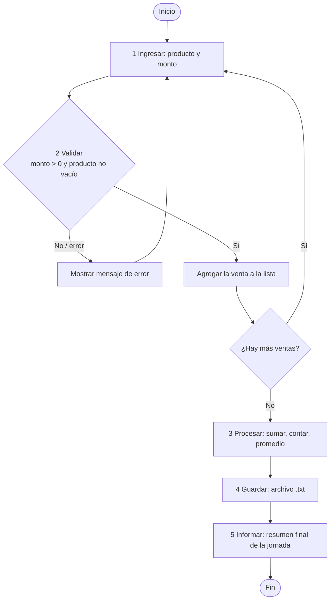

#  Nota Maestra: Repaso de Programación I y Conexión a Archivos

> [!NOTE] Guía rápida para ti (Moisés)
> Esta nota resume la **Clase 1 de Taller de Programación II** (semana de repaso). Está dividida en **pasos pequeños y secuenciales** para que cada idea cierre antes de pasar a la siguiente. No necesitas memorizarla: basta con saber **en qué sección buscar** cuando programes.

---

## Introducción: Propósito del Repaso

Taller de Programación II **no parte desde cero**: convierte lo que ya aprendiste en Programación I en programas que se pueden **mantener** y **reutilizar**.

**Cadena que ya conoces** (y que TP1 te dio):

```
Datos  →  Decisiones  →  Repeticiones  →  Funciones  →  Archivos
```

En cada ejecución, tu programa recibe **datos de entrada**, toma **decisiones** (condicionales), **repite** tareas (ciclos) y, con TP2, **guardará** resultados (archivos) para que no se pierdan al terminar.

> [!NOTE] Meta del repaso
> Usar estas piezas (variables, condicionales, ciclos, listas y funciones) para **leer, procesar y guardar** información de forma ordenada. El caso conductor de toda la clase es el **registro de ventas de una feria**.

 **Índice del repaso:**
- **01** Variables → guardar datos
- **02** Condicionales → tomar decisiones
- **03** Ciclos → repetir tareas
- **04** Listas → agrupar datos
- **05** Funciones → separar responsabilidades

---

## Sección 1: Variables y Tipos de Datos

### 1.1 ¿Qué es una variable?

**Una variable es una caja con nombre que guarda un valor.** El **tipo** de ese valor indica qué operaciones tienen sentido hacer con él (sumar, unir textos, comparar…).

| Tipo | Nombre python | Sirve para… | Ejemplo |
| :--- | :--- | :--- | :--- |
| **Texto** | `str` | Nombres, mensajes, fechas | `"Andrea"`, `"Mango"` |
| **Entero** | `int` | Cantidades sin decimales | `12` |
| **Decimales** | `float` | Montos, medidas con coma | `18500.50` |
| **Lógico** | `bool` | Respuestas verdadero/falso | `True`, `False` |

### 1.2 Ejemplos de asignación

```python
nombre = "Andrea"     # str
ventas = 12           # int
total = 18500.50      # float
activo = True         # bool

# Para probar en la consola:
texto = "Hola"
largo = len("amarillo")   # largo de un texto -> 8
```

### 1.3 Antes de programar, pregúntate

1. **¿Qué dato debo guardar?** Por ejemplo: nombre, monto, fecha o estado.
2. **¿Qué tipo representa mejor ese dato?** Evita mezclar texto con números.

### 1.4  El peligro común: `input()` sin convertir

`input()` **siempre devuelve texto** (un `str`), aunque el usuario escriba un número. Si intentas sumar, Python **une los textos** en lugar de sumar los números.

** MAL (no hace la suma):**
```python
monto1 = input("Primer monto: ")   # "1500"
monto2 = input("Segundo monto: ")  # "800"
print(monto1 + monto2)             # "1500800"  <- unió textos
```

** BIEN (se convierte con `float()`):**
```python
monto1 = float(input("Primer monto: "))   # 1500.0
monto2 = float(input("Segundo monto: "))  # 800.0
print(monto1 + monto2)                     # 2300.0  <- suma real
```

> [!WARNING] Regla de oro
> Si el dato va a usarse en **operaciones numéricas**, conviértelo con `int()` o `float()`. La suma de texto NO es suma: es una concatenación.

### 1.5 Tipado dinámico vs. tipado estático

- **Tipado dinámico (Python):** la variable **no declara su tipo**; el tipo se **infiere al asignar** y puede cambiar con el tiempo:

```python
x = 5        # int
x = "Hola"   # ahora str (¡Python lo permite!)
```

- **Tipado estático (Java, C++):** el tipo se **declara al inicio** y no puede cambiar sin conversión explícita:

```java
int x = 5;   // el tipo queda fijado al declarar
```

**En resumen:** Python es dinámico: más flexible, pero el programador debe vigilar qué tipo guarda cada variable. Si mezclas tipos, aplica **conversión explícita** con `int()`, `float()` o `str()`.

---

## Sección 2: Estructuras Condicionales y Validación

### 2.1 Los condicionales protegen la calidad de los datos

Antes de procesar o **guardar** un dato, verifica que cumpla las **reglas del problema**.

>  **GIGO = Garbage In, Garbage Out** (*"Basura entra, basura sale"*)
> Valida la entrada ANTES de procesar. Un dato inválido que entra a un archivo complicará todo el programa restante.

### 2.2 Operadores relacionales (comparan)

Siempre devuelven `True` o `False`:

| Operador | Significado |
| :--- | :--- |
| `==` | Igual a |
| `!=` | Distinto de |
| `>` | Mayor que |
| `<` | Menor que |
| `>=` | Mayor o igual que |
| `<=` | Menor o igual que |

### 2.3 Operadores lógicos

| Operador | Nombre |
| :--- | :--- |
| `and` | Conjunción lógica |
| `or` | Disyunción lógica |
| `not` | Negación lógica |

```python
(True or (not True)) and (not False)     # True
((3 + 4) < 1) and ((2 * 3) ** 2 >= 5)   # False
```

### 2.4 Sintaxis de las estructuras condicionales

**`if`** — ejecuta solo si la condición es verdadera:
```python
if condicion:
    instrucciones
```

**`if` — `else`** — ejecuta un grupo u otro:
```python
if monto > 0:
    print("Venta válida")
else:
    print("Error: el monto debe ser mayor a 0")
```

**`if` — `elif` — `else`** — la primera condición verdadera manda:
```python
if promedio >= 80:
    print("Excelente!")
elif promedio >= 55:
    print("Aceptable")
else:
    print("Debes mejorar")
```

>  **Atención con la sangría (indentación).** La indentación le dice a Python qué instrucciones **pertenecen** al `if`. Sé consistente: no mezcles espacios y tabs.

### 2.5 Piensa la condición como una pregunta

- ¿El monto es positivo?
- ¿La línea tiene los campos esperados?
- ¿El archivo existe?

La validación evita que la "basura" entre al archivo y complique el resto del programa.

---

## Sección 3: Estructuras de Repetición (Ciclos) y Colecciones

### 3.1 ¿Por qué repetir?

Procesar **muchos datos** sin repetir código a mano se logra con **ciclos**. Dos herramientas:

| Ciclo | ¿Cuándo usarlo? | ¿Cuántas veces repite? |
| :--- | :--- | :--- |
| `while` | Repite **mientras** una condición sea verdadera | Nº variable (hasta que la condición cambie) |
| `for` | Recorre una **colección** o un rango | Nº conocido (una vez por cada elemento) |

### 3.2 El ciclo `while`

```python
while condicion:
    instrucciones
```

> **Importante:** la condición se evalúa después de cada iteración; si ya es falsa al inicio, las instrucciones **NO se ejecutan ninguna vez**.

```python
# Mientras n sea menor que 10, imprimir n
n = 1
while n < 10:
    print(n)
    n += 1   # ¡Debes modificar la condición, o el ciclo nunca termina!
```

### 3.3 El ciclo `for` (recorrido de colección)

```python
ventas = [12500, 8000, 15400, 9200]
for venta in ventas:
    print(venta)      # 12500, 8000, 15400, 9200
```

### 3.4 Colecciones: Listas vs. Tuplas

| Colección | Mutable | Uso recomendado |
| :--- | :--- | :--- |
| **Lista** `[ ]` |  Sí (agregar, quitar, modificar) | Colecciones que cambian (`ventas_del_dia`) |
| **Tupla** `( )` |  No (inmutable, no cambia) | Valores que van **juntos** por naturaleza (`(producto, monto)`) |

**Listas — crear, agregar, range:**
```python
ventas = []               # lista vacía
ventas.append(1500.0)     # agregar al final
valores = list(range(5))  # [0, 1, 2, 3, 4]
```

**Tuplas y desempaquetado:**
```python
venta = ("Mango", 800)        # tupla: producto y monto juntos
producto, monto = venta       # desempaquetado
print(producto)               # Mango
```

### 3.5 El patrón del acumulador (¡el más importante del repaso!)

Patrón de código para **sumar cosas**:

1. **Preparar el acumulador** → `total = 0`
2. **Repetir por cada dato** → un `for` o `while`
3. **Actualizar el resultado** → `total = total + venta`
4. **Mostrar o retornar** → `print(total)` o `return total`

```python
ventas = [12500, 8000, 15400, 9200]
total = 0                      # 1. preparar acumulador
for venta in ventas:           # 2. repetir por cada dato
    total = total + venta      # 3. actualizar (equivale a total += venta)
print("Total:", total)         # 4. mostrar -> Total: 45700
```

>  **Variantes del patrón** (vistas en las diapositivas de ciclos):
> - **Sumar**: `total = total + n`
> - **Multiplicar**: `prod = prod * n`
> - **Contar**: `cuenta = cuenta + 1`
> - **Máximo**: `if n > mayor: mayor = n`
> - **Mínimo**: `if n < menor: menor = n`
> - **Combinaciones**: ciclos anidados con `i` y `j`

Con el acumulador se calculan los resúmenes clásicos: el **promedio** $\bar{x} = \frac{\text{suma}}{n}$ o, por ejemplo, la **desviación estándar** $\sigma = \sqrt{\frac{\sum_{i=1}^{n} (x_i - \bar{x})^2}{n}}$ (ejercicio del módulo de listas).

---

## Sección 4: Funciones, Parámetros y Retornos

### 4.1 ¿Qué es una función?

Una **función** es código **encapsulado** y **reutilizable**: se define una vez y se usa cuando se necesita. Recibe **parámetros** y **retorna** un valor.

```python
def calcular_total(ventas):
    total = 0
    for venta in ventas:
        total += venta        # total = total + venta
    return total
```

>  **Lee la función como una oración:** *"calcular_total recibe ventas y devuelve un total"*. La función encapsula **cómo**; el programa principal expresa **qué**.

**Una buena función tiene UNA responsabilidad:** validar, calcular, leer o guardar.

### 4.2 Parámetro – Retorno – Llamada

| Concepto | Qué es | Ejemplo |
| :--- | :--- | :--- |
| **Parámetro** | Dato que **entra** a la función | `ventas` |
| **Retorno** | Resultado que la función **entrega** | `total` |
| **Llamada** | Uso concreto de la función | `calcular_total(ventas)` |

```python
resultado = calcular_total(ventas)   # llamada que guarda el retorno
print(resultado)                      # mostrar en pantalla
```

### 4.3  Advertencia crucial: `print` vs. `return`

Esta es la diferencia **técnica más importante** del repaso:

- `print(valor)` → **muestra** el valor por pantalla. *Efecto visual.* El programa NO recuerda el valor después de mostrarlo.
- `return valor` → **entrega** el valor al código que llamó a la función. Ese valor puede guardarse en una variable, pasarse a otra función o usarse en un cálculo. *Pensado para la lógica y la reutilización.*

** MAL (no reutilizable):**
```python
def perimetro(r):
    resultado = 2 * 3.14 * r
    print(resultado)       # solo muestra; nadie puede usar "resultado"
```

** BIEN (reutilizable):**
```python
def area_circulo(r):
    return 3.1416 * r ** 2

radio = float(input("Radio: "))
area = area_circulo(radio)    # "area" ya tiene el valor
print(f"El área es {area:.2f}")
```

> [!WARNING] Regla práctica
> - Si la función debe **producir un valor** para seguir calculando → usa `return`.
> - Si solo quieres **mostrarle algo al usuario** → usa `print`.
> - Una función que usa `print` **en lugar de `return`** devuelve `None`: no podrás guardar su resultado en otra variable.

### 4.4 Tipos de funciones (de las diapositivas)

```python
# 1) Con un valor de retorno
def promedio_redondeado(c1, c2, c3):
    return round((c1 + c2 + c3) / 3)

# 2) Con múltiples valores de retorno
def convertir_horas_min(total_minutos):
    horas = total_minutos // 60
    minutos = total_minutos % 60
    return horas, minutos

# 3) Sin valor de retorno (solo imprime)
def imprimir_datos(nombre, apellido):
    print("Nombre:", nombre, apellido)

# 4) Parámetros por omisión (opcionales)
def funcion(a, b=2, c=10):
    return a + b + c
```

### 4.5 Primer paso a módulos

Un **módulo** es un archivo `.py` con funciones que se importan:

```python
from math import pi
# o
import math
```

Antes de escribir un programa, **analiza si existe un patrón de código** conocido para un problema similar (sumar, contar, máximo, mínimo, combinaciones).

---

## Sección 5: Caso de Estudio Guía — Registro de Ventas de una Feria

> **Caso conductor:** la feria necesita registrar cada venta y obtener un resumen de su **jornada**. Usaremos este mismo caso para reconocer cómo TP1 prepara el camino hacia los archivos de TP2.

### 5.1 Flujo en 5 pasos

```
1. INGRESAR  → 2. VALIDAR  → 3. PROCESAR  → 4. GUARDAR  → 5. INFORMAR
   monto /       ¿dato          sumar y        archivo .txt    resumen final
   nombre        correcto?      contar         / .csv
```

**Paso a paso del caso (lo que analizamos en clase):**
- **¿Qué se debe conservar?** producto, monto y fecha.
- **¿Cada cuánto se agrega?** una vez por **cada venta**.
- **¿Qué se quiere consultar?** el total diario y el producto más vendido.
- **¿Qué puede salir mal?** monto inválido o registro incompleto → **hay que validar**.

### 5.2 Diagrama de flujo (Mermaid)



### 5.3 Script Python completo (todos los conceptos juntos)

> Este programa aplica: **funciones** (cada etapa es una función), **listas de tuplas**, **acumulador**, **validación** (GIGO) y **try-except** (robustez). Cópialo y pruébalo variando los datos de entrada.

```python
# ------------------------------------------------------------
# registro_feria.py — Registro de ventas de una feria
# Aplica: funciones, listas, validación, acumulador y guardado.
# ------------------------------------------------------------

ARCHIVO_VENTAS = "ventas_feria.txt"

# ---- Paso 1 y 2: INGRESAR + VALIDAR ------------------------
def leer_monto(mensaje):
    """Pide un monto hasta que el dato sea un número válido y mayor a 0."""
    while True:
        texto = input(mensaje).strip()
        try:
            monto = float(texto)
        except ValueError:
            print(f'Error: "{texto}" no es un número válido.')
            continue
        if monto <= 0:
            print("Error: el monto debe ser mayor a 0.")
            continue
        return monto

def pedir_venta():
    """Pide producto + monto validado y devuelve una tupla (producto, monto)."""
    producto = input("Producto: ").strip()
    monto = leer_monto("Monto de la venta: ")
    if not producto:                       # validación GIGO
        print("Error: el producto no puede quedar vacío.")
        return None
    return (producto, monto)

# ---- Paso 3: PROCESAR (patrón acumulador en funciones) ------
def calcular_total(ventas):
    total = 0
    for producto, monto in ventas:
        total += monto
    return total

def calcular_promedio(ventas):
    if not ventas:
        return 0
    return calcular_total(ventas) / len(ventas)

def producto_mas_vendido(ventas):
    if not ventas:
        return None
    mejor_producto, mejor_monto = ventas[0]
    for producto, monto in ventas[1:]:
        if monto > mejor_monto:
            mejor_producto, mejor_monto = producto, monto
    return (mejor_producto, mejor_monto)

# ---- Paso 4: GUARDAR en un archivo .txt ---------------------
def guardar_ventas(ventas, nombre_archivo):
    with open(nombre_archivo, "w") as archivo:
        for producto, monto in ventas:
            archivo.write(f"{producto},{monto:.2f}\n")
    print(f"Ventas guardadas en {nombre_archivo}")

# ---- Paso 5: INFORMAR resumen final -------------------------
def informar_resumen(ventas):
    total = calcular_total(ventas)
    mejor = producto_mas_vendido(ventas)
    print("\n=== RESUMEN DE LA JORNADA ===")
    print(f"Ventas registradas: {len(ventas)}")
    print(f"Total del día: {total:,.2f}")
    print(f"Promedio por venta: {calcular_promedio(ventas):,.2f}")
    if mejor:
        print(f"Producto más vendido: {mejor[0]} con {mejor[1]:,.2f}")
    else:
        print("Aún no hay ventas para resumir.")

# ---- PROGRAMA PRINCIPAL -------------------------------------
def main():
    ventas = []
    seguir = True
    while seguir:
        venta = pedir_venta()               # Ingresar + Validar
        if venta:
            ventas.append(venta)            # Guardar en la lista (memoria)
            print(f"Venta registrada: {venta[0]} por {venta[1]:.1f}\n")
        respuesta = input("¿Registrar otra venta? (s/n): ").strip().lower()
        seguir = respuesta == "s"
    guardar_ventas(ventas, ARCHIVO_VENTAS)  # Guardar (archivo)
    informar_resumen(ventas)                # Procesar + Informar

if __name__ == "__main__":
    main()
```

### 5.4 El Puente a TP2 (Persistencia)

Hasta ahora, los datos **viven en variables y listas**: al cerrar el programa, **desaparecen**.

| Taller de Programación I | Próximo desafío en TP2 |
| :--- | :--- |
| Lista de ventas durante una ejecución | Registro de ventas **permanente** |
| • se crea<br/>• se procesa<br/>• se pierde al terminar | • queda guardado<br/>• se recupera **otro día**<br/>• se puede actualizar |

**¿Por qué no bastan los datos en memoria?**
- Porque la memoria es **volátil**: se limpia al apagar o cerrar el programa.
- **El archivo** es el lugar donde los datos **permanecen** (disco duro).
- En TP2 el problema es: **conservar las ventas diarias** para consultar un resumen al día siguiente. El archivo solo será el lugar donde los datos permanecen; el procesamiento sigue usando tus bases (variables, condicionales, ciclos, listas y funciones).

> [!IMPORTANT] Conclusión
> **TP2 no reemplaza lo aprendido; lo conecta con datos que permanecen.** El manejo de archivos responde a una **necesidad del problema**, no es un fin en sí mismo.

**Separación mental de tareas del futuro sistema** (el análisis con que cierra la clase):

`Registrar → Conservar → Validar → Procesar → Informar` = **una responsabilidad por módulo** (las funciones y módulos asignarán responsabilidades claras a cada parte).

---

## Enriquecimiento: Reglas de Estilo PEP 8 (nombres limpios)

> **PEP 8** (*Style Guide for Python Code*) es la guía de estilo **oficial** de Python, publicada en 2001 por Guido van Rossum, Barry Warsaw y Alyssa Coghlan. Seguirla hace el código **legible, consistente y mantenible** (clave para trabajar en equipos y para que tu yo del futuro te entienda).

| Elemento | Convención | Ejemplo |
| :--- | :--- | :--- |
| **Función** | Palabras en minúscula separadas por `_` (snake_case) | `calcular_total` |
| **Variable** | Igual que las funciones (snake_case) | `ventas_del_dia` |
| **Método** | Igual que las funciones | `guardar_ventas` |
| **Clase** | CapWords / CamelCase | `RegistroVentas` |
| **Constante** | Mayúsculas con `_` | `ARCHIVO_VENTAS` |
| **Módulo** | Corto, en minúsculas | `registro_ventas.py` |

Recomendaciones clave:
- **Nombres descriptivos**: prefiere `monto` en vez de `x`, y `total_ventas` en vez de `t`.
- **Evita** `l` (ele), `O` (o) e `I` (i) como nombres de una letra: se confunden con dígitos.
- **Constantes en mayúsculas**: `IVA_REFERENCIA = 0.19`.
- **Indentación uniforme**: 4 espacios, sin mezclar con tabs.

---

## Enriquecimiento: Manejo de Excepciones (`try` — `except`)

> **Base académica:** en Python, un error que ocurre en ejecución (aunque el código sea sintácticamente correcto) se llama **excepción** (tutorial oficial de Python, sección *Errors and Exceptions*). Por ejemplo, `float("abc")` lanza un `ValueError` porque no puede convertir el texto a un número real. Si no se maneja, el programa **se detiene** mostrando un *traceback*.

**Sintaxis básica:**

```python
try:
    monto = float(input("Monto: "))
except ValueError:
    print("Eso no es un número. Intenta de nuevo.")
```

**Cómo funciona (pasos):**
1. Ejecuta el código dentro del `try`.
2. Si **no** ocurre una excepción → se salta el `except` y el programa sigue.
3. Si **ocurre** una excepción del tipo listado en el `except` (aquí `ValueError`) → se ejecuta el bloque de manejo y el programa **continúa**.
4. Si la excepción no coincide con la cláusula `except` → se propaga hacia afuera y el programa termina con error.

**Buenas prácticas:**
- Captura **excepciones específicas** (`ValueError`, `ZeroDivisionError`) y evita el `except:` universal, que oculta errores inesperados.
- En Python se prefiere **EAFP** (*Easier to Ask for Forgiveness than Permission*): intentar la operación y atrapar el error, en vez de revisar todo antes (LBYL).
- Mantén los bloques `try` **lo más pequeños posible**.
- **No** uses excepciones para encubrir errores de programación (dificulta la depuración).
- Existen cláusulas opcionales: `else` (se ejecuta solo si el `try` no lanzó excepción) y `finally` (se ejecuta siempre; ideal para cerrar archivos).

**En nuestro caso de la feria**, `leer_monto()` usa exactamente este patrón con un `while` para **reintentar** hasta conseguir un valor válido (la basura nunca llega al archivo).

---

## Autoevaluación (4 preguntas para verificar el repaso)

*Haz clic en cada pregunta para mostrar la respuesta oculta.*

<details>
<summary>Pregunta 1 — Variables: ¿cuál es la salida de este código y por qué?</summary>

```python
a = input("Número: ")   # usuario escribe 5
b = input("Número: ")   # usuario escribe 3
print(a + b)
```
**Respuesta:** `"53"` (el 5 y el 3 pegados como texto). Porque `input()` devuelve un **str**, por lo que `+` **concatena** textos y no suma números. Para sumar de verdad: `a = float(input(...))` y `b = float(input(...))`.

</details>

<details>
<summary>Pregunta 2 — Condicionales: escribe la validación de un monto de venta</summary>

"El monto debe ser mayor que 0; si no, mostrar error. Si es válido, avisar que la venta es válida."
```python
monto = float(input("Monto: "))
if monto > 0:
    print("Venta válida")
else:
    print("Error: el monto debe ser mayor a 0")
```
**Idea clave:** la validación se hace **antes** de guardar o sumar, para aplicar "Garbage In, Garbage Out".

</details>

<details>
<summary>Pregunta 3 — Ciclos y listas: escribe el patrón del acumulador para totalizar</summary>

```python
ventas = [12500, 8000, 15400, 9200]
total = 0
for venta in ventas:
    total = total + venta   # o: total += venta
print("Total:", total)      # Total: 45700
```
**Recuerda los 4 pasos:** preparar el acumulador → recorrer cada dato → actualizar → mostrar/retornar.

</details>

<details>
<summary>Pregunta 4 — print vs return: ¿cuál función permite reutilizar el valor?</summary>

```python
def area_print(r):
    print(3.1416 * r * r)      # (A)

def area_return(r):
    return 3.1416 * r * r      # (B)
```
**Respuesta:** la **(B)** con `return` permite guardar el valor y seguir calculando (`area = area_return(5)`). La **(A)** con `print` solo muestra en pantalla; su resultado queda `None` y no se puede capturar. **Recuerda: `print` muestra, `return` entrega.**

</details>

---

---

##  Conexiones del Grafo (SCC=1)

-  [Dashboard Taller de Programación II](taller_programacion_ii_dashboard.md)
-  [Setup Prompt — Taller Programación II](Setup_Prompt.md)
-  [Nota Maestra: Manejo de Archivos en Python](Manejo_Archivos_Python.md)
-  [II° Semestre Dashboard](II_Semestre_Dashboard.md)

> [!HINT] Fuentes procesadas
> - `Teoria/Unidad_0_Repaso/Repaso_Taller_Programacion_1_AnteSala_TP2.pdf` (.pptx) · Clase 1
> - `Teoria/Unidad_0_Repaso/Variables y Condicionales.pdf` (.pptx)
> - `Teoria/Unidad_0_Repaso/Python Ciclos While.pdf` (.pptx)
> - `Teoria/Unidad_0_Repaso/Python Listas Tuplas.pdf` (.pptx)
> - `Teoria/Unidad_0_Repaso/Funciones y Metodos.pdf` (.pptx)

---
 [Panel de Control Unificado](Home.md)

